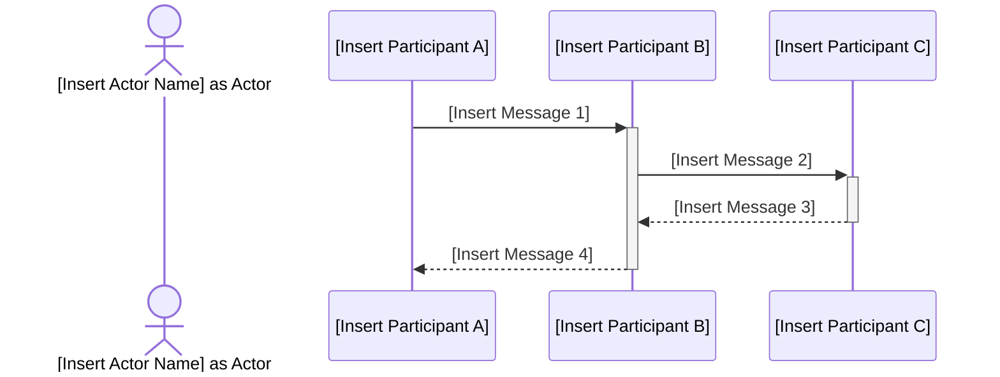
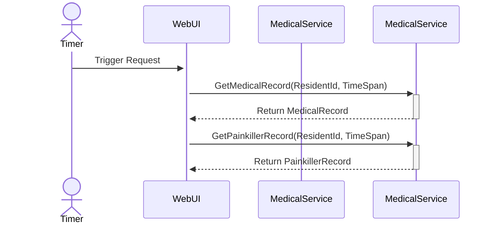
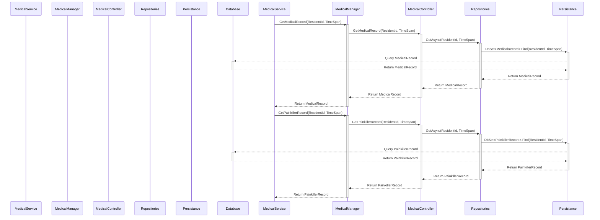

# SD Instructions (Summary)
- Use the provided SD markdown template or examples.
- Replace all placeholders with project-specific content.
- Store SD files in `docs/use-cases/uc-<Insert Use Case Identifier>*/` as `uc-<Insert Use Case Identifier>.sd.<Insert Version>.md`.
- Increment version numbers for significant changes; keep only the latest version in main, archive older versions.
- Include metadata, version log (with date, author), and use Mermaid sequence diagram.
- Create files in English; if product owner domain language differs, create a separate file with language code suffix.
- Update glossary files for new terms.
- Validate SDs for completeness, clarity, and template compliance.


## SD Template (Minimal):
```markdown
# [Insert Sequence Diagram Title]


## Metadata
| Key            | Value           |
|----------------|-----------------|
| Id             | [Use case].SD   |
| crossReference | [Use case].SSD [Use case].OC   |

## Version Log
| Version | Date       | Description | Author |
|---------|------------|-------------|--------|
| 0001    | [date]     | Initial     | [name] |


## Sequence Diagram
```



```
**Note:** While Strict UML purists argue that actor is not part of sequence diagram, we can use actor in sequence diagram if it helps to clarify the interactions and roles of different participants in the system. The key is to ensure that the diagram remains clear and easy to understand for all stakeholders even it breaks strict UML rules.

---

**Note on DTOs and Data Transformation:**
[Insert any notes regarding the need for Data Transfer Objects (DTOs) or data transformation between layers, if applicable. Provide examples of how data should be transformed if necessary.]

[Show class example if needed, e.g., for a DTO or data transformation]
```

## SD Example

```markdown
# Use case 003 - Request Medical Record and Painkiller Record Sequence Diagram

## Metadata
| Key            | Value           |
|----------------|-----------------|
| Id             | UC-003.SD  |
| crossReference | UC-003.SSD UC-003.OC   |

## Version Log
| Version | Date       | Description | Author |
|---------|------------|-------------|--------|
| 0001    | 23.03.2026 | Initial     | Team 6 |

## Sequence Diagram
### Presentation → Application
```



```markdown
### Application → Infrastructure - External Interfaces
```



```markdown
**Note:** This sequence diagram illustrates the interactions between various components of the system when a timer triggers a request for medical records and painkiller records. The diagram shows how the WebUI interacts with the MedicalService, which in turn interacts with the MedicalManager, MedicalController, Repositories, Persistance layer, and Database to retrieve the necessary information.

**Note on DTOs and Data Transformation:**
In this example, if there is a need for Data Transfer Objects (DTOs) to facilitate data transfer between layers, we can define DTOs for MedicalRecord and PainkillerRecord. For instance, we might have a `MedicalRecordDTO` that contains only the necessary fields required by the WebUI, and a `PainkillerRecordDTO` for the painkiller information. The MedicalController can be responsible for transforming the data from the database entities to the DTOs before returning them to the MedicalManager and ultimately to the WebUI.
```

