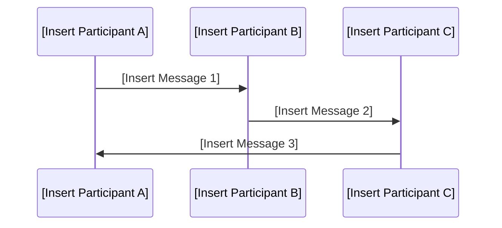

# Sequence Diagram Instructions

This instruction file provides a template and quality criteria for documenting Sequence Diagrams in markdown format using Mermaid syntax.
Use this as a starting point for any project requiring a Sequence Diagram.
Replace all placeholders in the template with project-specific content.

## General Instructions

- Use this template for all Sequence Diagram documentation in markdown format.
- Replace all bracketed placeholders in the Mermaid diagram with project-specific information.
- Store Sequence Diagram files in the centralized repository.
- Review and approve Sequence Diagrams with relevant stakeholders before acceptance.

## Best Practices

- Clearly define all relevant participants and interactions.
- Use clear, concise, and process-oriented language.
- Document all assumptions and dependencies.
- Ensure visuals and layout are consistent and easy to understand.
- Use valid Mermaid sequence diagram syntax.

## Code Standards

- Each Sequence Diagram must have a unique version identifier and a documented change log.
- Use the provided Mermaid diagram layout for consistency.

### File Naming
- Name files in lowercase, using digits for version, following the pattern: `qc-seqdiagram.xxxx.md` (e.g., `qc-seqdiagram.0001.md`).

## Common Patterns
### Good Example
```markdown
## Metadata
| Key               | Value                             |
|-------------------|-----------------------------------|
| Id                | QC-SEQDIAGRAM                     |
| crossReference    |                                   |

## Version
- **Version**: 0001
- **Date**: 2026-02-07

## Version Log
| Version | Date       | Description              | Author     |
|---------|------------|--------------------------|------------|
| 0001    | 2026-02-07 | Initial                  | project owner |
```



### Bad Example
```
sequenceDiagram
    [Participant 1] -> [Participant 2]: [Message]
    [Participant 2] -> [Participant 3]: [Message]
```

## Validation

- Review Sequence Diagrams for completeness, clarity, and correct use of the Mermaid template.
- Verify that all placeholders are replaced with project-specific content.
- Ensure Mermaid syntax is valid and renders correctly.

## Maintenance

- Update the version and change log for major changes.
- Regularly review Sequence Diagrams for accuracy and relevance.
