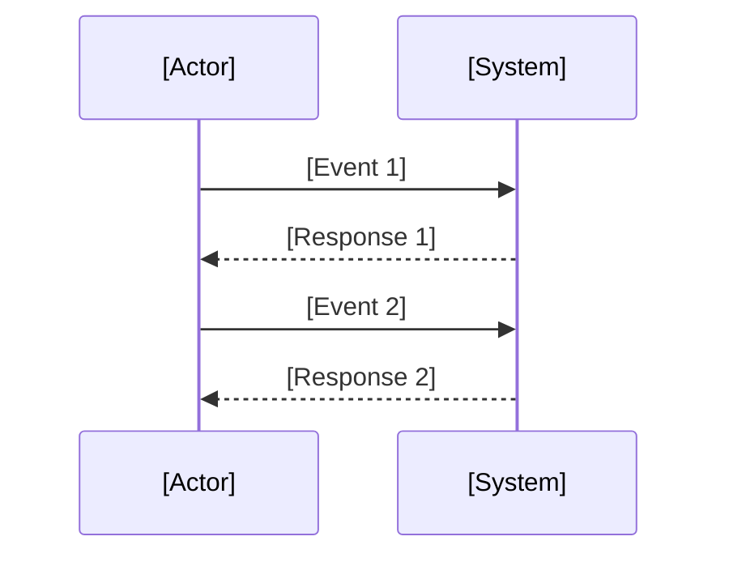

# System Sequence Diagram (SSD) Instructions

This instruction file provides a template and quality criteria for documenting System Sequence Diagrams (SSD) in markdown format.
Use this as a starting point for any project requiring an SSD. Replace all placeholders in the diagram with project-specific content.

## General Instructions

- Use this template for all SSD documentation in markdown format.
- Replace all bracketed placeholders in the diagram with project-specific information.
- Store SSD files in the centralized repository.
- Review and approve SSDs with relevant stakeholders before acceptance.

## Best Practices

- Clearly define all actors, system boundaries, events, and responses.
- Use clear, concise, and system-oriented language.
- Document all assumptions and dependencies.
- Ensure visuals and layout are consistent and easy to understand.

## Code Standards

- Each SSD must have a unique version identifier and a documented change log.
- Use the provided Mermaid sequence diagram layout for consistency.

### File Naming
- Name files in lowercase, using digits for version, following the pattern: `ssd.xxxx.md` (e.g., `ssd.0001.md`).

## Common Patterns
### Good Example
```markdown
## Metadata
| Key               | Value                             |
|-------------------|-----------------------------------|
| Id                | SSD                               |
| crossReference    |                                   |

## Version
- **Version**: 0001
- **Date**: 2026-01-20

## Version Log
| Version | Date       | Description              | Author     |
|---------|------------|--------------------------|------------|
| 0001    | 2026-01-20 | Initial                  | project owner |
```

```markdown
## System Sequence Diagram
<!-- System Sequence Diagram Template: Replace all [Insert ...] placeholders with project-specific content. -->
```meramid
sequenceDiagram
    actor [Insert Actor]
    participant [Insert System]
    [Insert Actor] ->> [Insert System]: [Insert Event 1]
    [Insert System] -->> [Insert Actor]: [Insert Response 1]
    [Insert Actor] ->> [Insert System]: [Insert Event 2]
    [Insert System] -->> [Insert Actor]: [Insert Response 2]
    %% Add more events/responses as needed
```
```

### Bad Example



## Validation

- Review SSDs for completeness, clarity, and correct use of the template.
- Verify that all placeholders are replaced with project-specific content.

## Maintenance

- Update the version and change log for major changes.
- Regularly review SSDs for accuracy and relevance.
