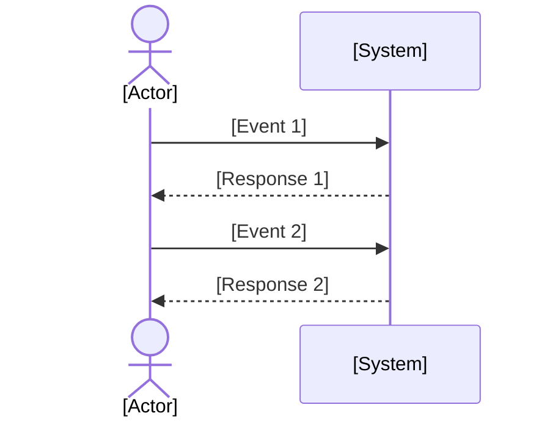

# SSD Instructions (Summary)
- Use the provided SSD markdown template.
- Replace all placeholders with project-specific content.
- Store SSD files in `docs/use-cases/uc-<Insert Use Case Identifier>*/` as `uc-<Insert Use Case Identifier>.ssd.<Insert Version>.md`.
- Increment version numbers for significant changes; keep only the latest version in main, archive older versions.
- Include metadata, version log (with date, author), and use Mermaid sequence diagram.
- Create files in English; if product owner domain language differs, create a separate file with language code suffix.
- Update glossary files for new terms.
- Validate SSDs for completeness, clarity, and template compliance.

## SSD Template (Minimal):
```markdown
## Metadata
| Key            | Value           |
|----------------|-----------------|
| Id             | [Use case].SSD  |
| crossReference | [Use case].DM   |

## Version Log
| Version | Date       | Description | Author |
|---------|------------|-------------|--------|
| 0001    | [date]     | Initial     | [name] |

## System Sequence Diagram
```

```mermaid
sequenceDiagram
    actor [Actor]
    participant [System]
    [Actor] ->> [System]: [Event 1]
    [System] -->> [Actor]: [Response 1]
    [Actor] ->> [System]: [Event 2]
    [System] -->> [Actor]: [Response 2]
```
