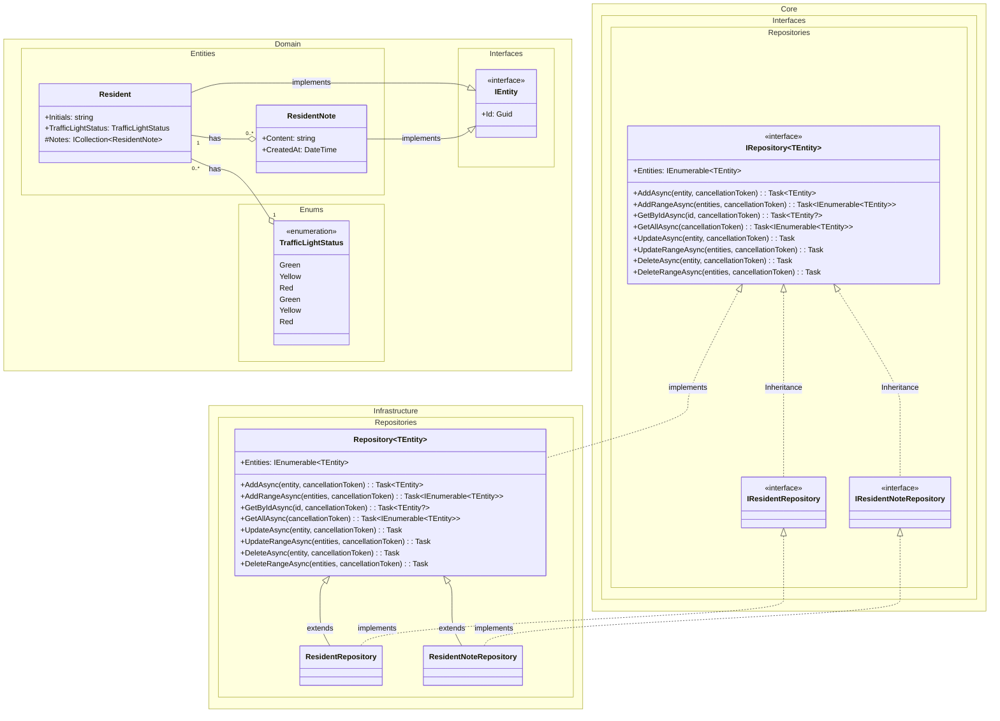

# Domain Class Diagram (DCD) for Solution Repositories and Interfaces

## Metadata
| Key            | Value                         |
|----------------|-------------------------------|
| Id             | DCD                           |
| crossReference | DM                            |

## Version Log
| Version | Date       | Description              | Author     |
|---------|------------|--------------------------|------------|
| 0001    | 2026-03-06 | Initial                  | Team 6     |

---

## Diagram for repositories and interfaces

---

This DCD documents the core repository and interface abstractions used in the solution, following Clean Architecture principles. All repositories implement the generic `IRepository<TEntity>` interface, which enforces CRUD operations for domain entities implementing `IEntity`. The `Repository<TEntity>` class provides a base implementation for infrastructure repositories.

> All placeholders have been replaced with project-specific content. See `/docs/quality-criteria/artifact/lld/qc-dcd.0001.md` for quality criteria and `/docs/glosery.md` for glossary updates if class names change from previous artifacts.
