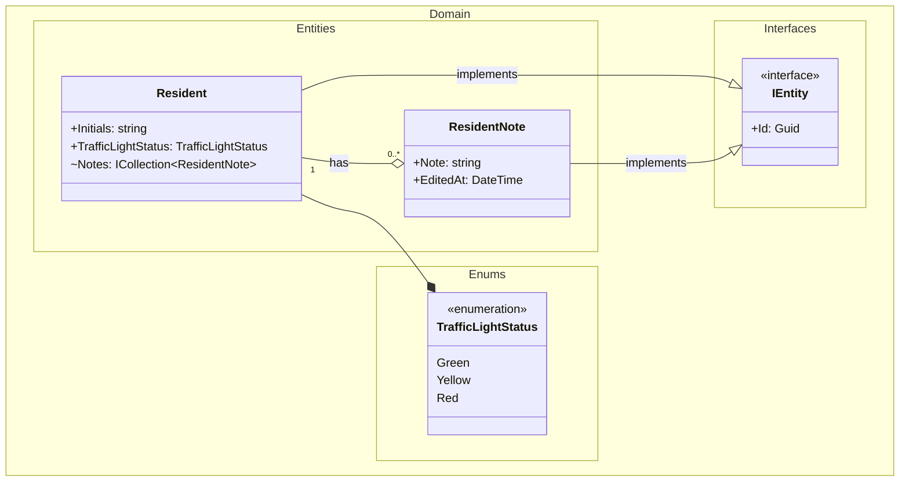
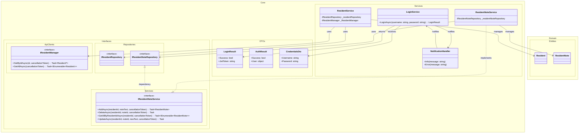
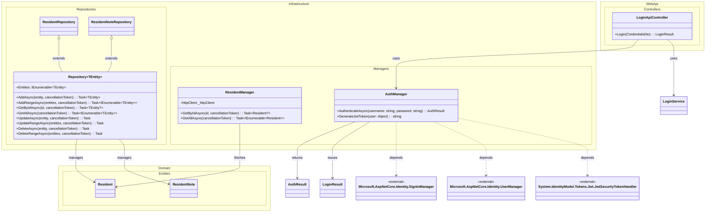
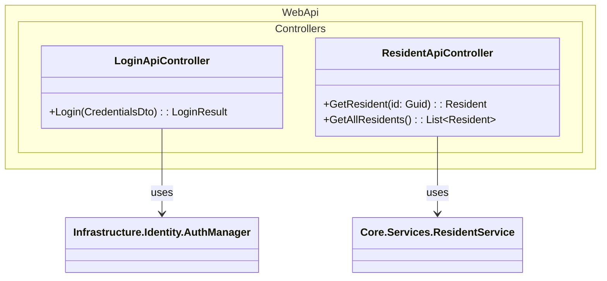
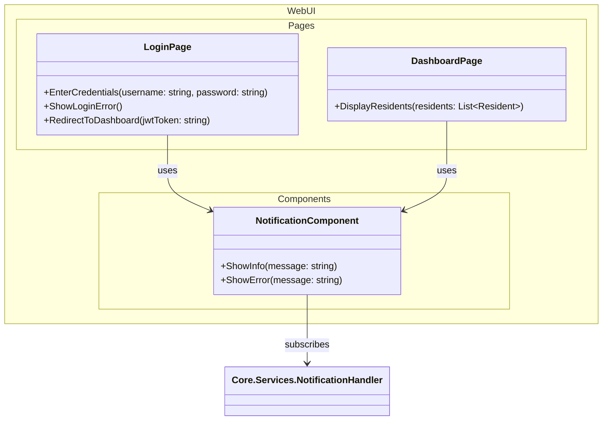

# Domain Class Diagram (DCD) for Solution Repositories and Interfaces

## Metadata
| Key            | Value                         |
|----------------|-------------------------------|
| Id             | DCD                           |
| crossReference | DM                            |

## Version Log
| Version | Date       | Description                        | Author     |
|---------|------------|------------------------------------|------------|
| 0001    | 2026-03-06 | Initial                            | Team 6     |
| 0002    | 2026-03-30 | Add login/auth classes from UC-004 | Team 6     |

---

## DCD for Domain Layer

---

## DCD for Core Layer

---

## DCD for Infrastructure Layer

---

This DCD documents the core repository and interface abstractions used in the solution, following Clean Architecture principles.

All repositories implement the generic `IRepository<TEntity>` interface, which enforces CRUD operations for domain entities implementing `IEntity`.
The `Repository<TEntity>` class provides a base implementation for infrastructure repositories.

---

## DCD for WebApi Layer

---

## DCD for WebUI Layer

