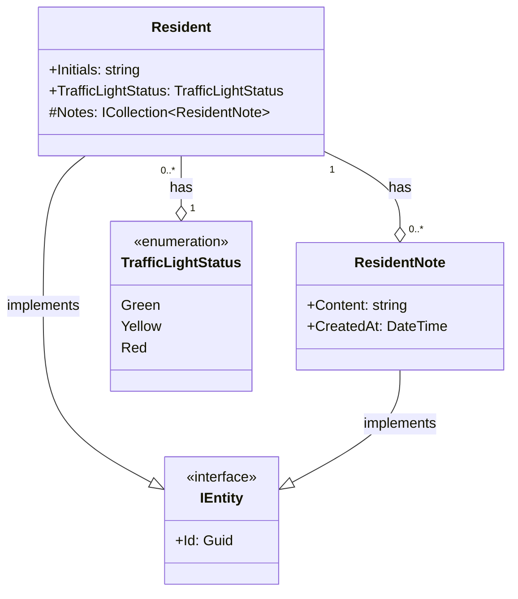
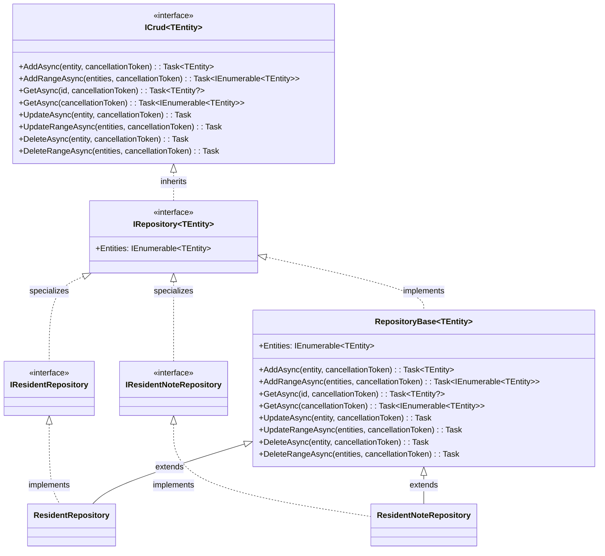
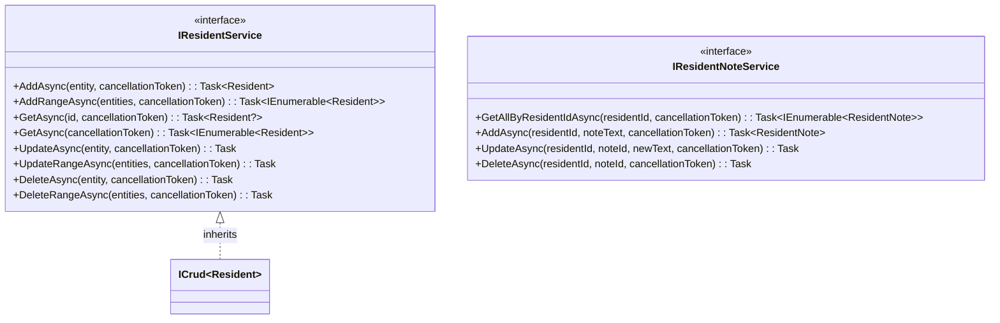

# Domain Class Diagram (DCD) for Solution Repositories and Interfaces

## Metadata
| Key            | Value                         |
|----------------|-------------------------------|
| Id             | DCD                           |
| crossReference | DM                            |

## Version Log
| Version | Date       | Description              | Author     |
|---------|------------|--------------------------|------------|
| 0001    | 2026-03-06 | Initial                  | Team 6     |

---

## Diagram for repositories and interfaces

## Domain Entities Diagram

### Note:

- The `Resident` entity represents an individual resident in the system, with properties for their initials and traffic light status. It has a collection of `ResidentNote` entities representing notes associated with the resident.
- The `ResidentNote` entity represents a note associated with a resident, containing content and a timestamp for when the note was created.
- The `TrafficLightStatus` enumeration defines the possible traffic light statuses for a resident.

---

## Repositories and Interfaces Diagram

---

This DCD documents the core repository and interface abstractions used in the solution, following Clean Architecture principles. All repositories implement the generic `IRepository<TEntity>` interface, which enforces CRUD operations for domain entities implementing `IEntity`. The `Repository<TEntity>` class provides a base implementation for infrastructure repositories.

> All placeholders have been replaced with project-specific content. See `/docs/quality-criteria/artifact/lld/qc-dcd.0001.md` for quality criteria and `/docs/glosery.md` for glossary updates if class names change from previous artifacts.

---

## Service Interfaces Diagram (Core Layer)

### Note:

- The `IResidentService` interface provides CRUD operations for the `Resident` entity, inheriting from the generic `ICrud<Resident>` interface.
- The `IResidentNoteService` interface provides note-specific operations for residents, such as adding, updating, and deleting notes, as well as retrieving all notes for a resident.
- The service interfaces are part of the Core layer and define the contracts for business logic related to residents and their notes.
