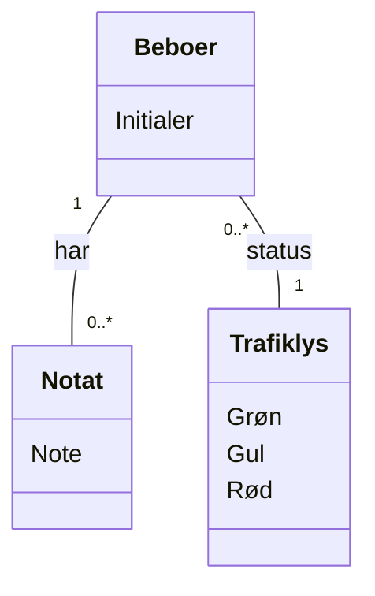

# Domain Model (DM) for Slottets Drifttavlen
## Metadata
| Key               | Value                             |
|-------------------|-----------------------------------|
| Id                | DM                                |
| crossReference    |                                   |

## Version Log
| Version | Date       | Description              | Author     |
|---------|------------|--------------------------|------------|
| 0001    | 2026-03-07 | Initial                  | Team 6     |

## Diagram

## Noter
- Beboer repræsenterer en person, der modtager pleje.
- Beboer har en trafiklysstatus (Trafiklys), der angiver aktuel tilstand (Grøn, Gul, Rød).
- Beboer kan have flere noter (Notat), hver med tekst, tidsstempel og reference til medarbejder.
- Initialer bruges til identifikation af beboer for at sikre GDPR-overholdelse.
