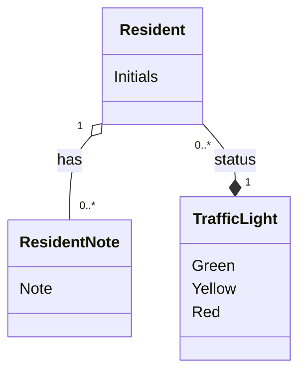

# Domain Model (DM) for Slottets Drifttavlen
## Metadata
| Key               | Value                             |
|-------------------|-----------------------------------|
| Id                | DM                                |
| crossReference    |                                   |

## Version Log
| Version | Date       | Description              | Author     |
|---------|------------|--------------------------|------------|
| 0001    | 2026-03-07 | Initial                  | Team 6     |

## Diagram

## Notes
- Resident represents a person receiving care (Beboer).
- Resident has a traffic light status (TrafficLight) indicating current condition (Green, Yellow, Red).
- Resident can have multiple notes (ResidentNote), each with text, timestamp, and caretaker reference.
- Initials are used for resident identification to ensure GDPR compliance.
