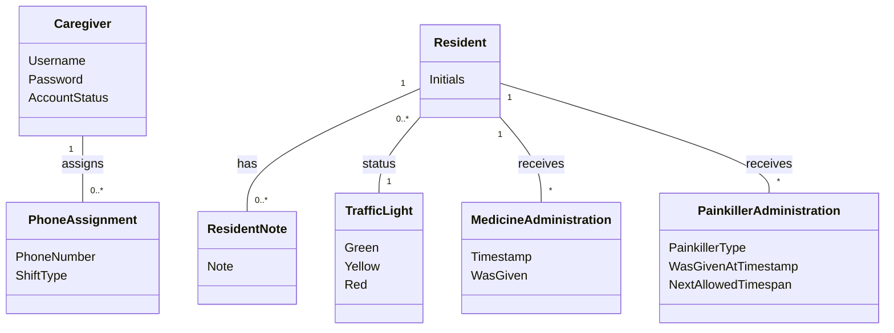

# Domain Model (DM) for Slottets Drifttavlen
## Metadata
| Key               | Value                             |
|-------------------|-----------------------------------|
| Id                | DM                                |
| crossReference    | BC                                |

## Version Log
| Version | Date       | Description              | Author     |
|---------|------------|--------------------------|------------|
| 0001    | 2026-03-07 | Initial                  | Team 6     |
| 0002    | 2026-03-31 | Added Caregiver and PhoneAssignment (UC-004, UC-005) | Team 6     |

## Diagram

## Notes

- Resident represents a person receiving care (Beboer).
- Resident has a traffic light status (TrafficLight) indicating current condition (Green, Yellow, Red).
- Resident can have multiple notes (ResidentNote), each with text, timestamp, and caretaker reference.
- Resident can have multiple medicine administration records (MedicineAdministration) with timestamp and status (WasGiven).
- Resident can have multiple painkiller administration records (PainkillerAdministration) with painkiller type, timestamp, was given at timestamp, and next allowed timespan.
- Initials are used for resident identification to ensure GDPR compliance.

- Caregiver represents a staff member (introduced in UC-004).
- PhoneAssignment represents assignment of a fixed phone number to a shift (introduced in UC-005). PhoneNumber is one of: 41522, 41523, 41524, 41525, 41526, 41527, 41529. ShiftType is one of: Day, Evening, Night.
