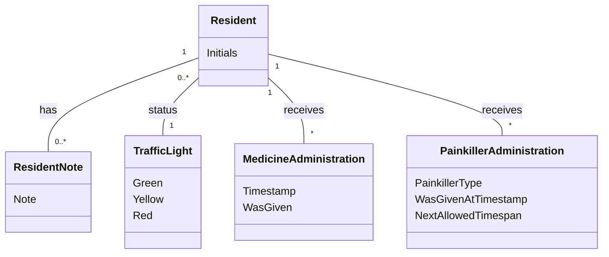

# Domain Model (DM) for Slottets Drifttavlen
## Metadata
| Key               | Value                             |
|-------------------|-----------------------------------|
| Id                | DM                                |
| crossReference    | BC                                |

## Version Log
| Version | Date       | Description              | Author     |
|---------|------------|--------------------------|------------|
| 0003    | 2026-03-20 | Add WasGivenAtTimestamp to PainkillerAdministration | Team 6     |

## Diagram

## Notes

- Resident represents a person receiving care (Beboer).
- Resident has a traffic light status (TrafficLight) indicating current condition (Green, Yellow, Red).
- Resident can have multiple notes (ResidentNote), each with text, timestamp, and caretaker reference.
- Resident can have multiple medicine administration records (MedicineAdministration) with timestamp and status (WasGiven).
- Resident can have multiple painkiller administration records (PainkillerAdministration) with painkiller type, timestamp, was given at timestamp, and next allowed timespan.
- Initials are used for resident identification to ensure GDPR compliance.
