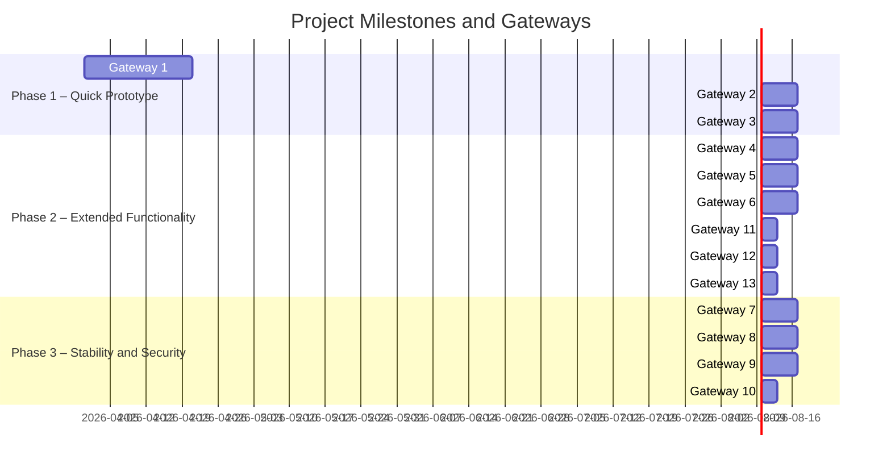

# Gateway for Slottet IT System

## Metadata
| Key               | Value                             |
|-------------------|-----------------------------------|
| Id                | MILESTONE                         |
| crossReference    | BC FURPS KPI                |

### Change Log
| Date       | Version | Description                     | Author        |
|------------|---------|---------------------------------|---------------|
| 2026-03-26 | 0001    | Initial creation of the document | Team 6        |
| 2026-04-29 | 0002    | Added milestones, gateways, and use cases | Team 6        |

---

## Gantt diagram

## Gateways & Milestones 
| Milestone/Gateway         | Description                                                                 | Entry Criteria                                 | Exit Criteria                                  |
|--------------------------|-----------------------------------------------------------------------------|-----------------------------------------------|-----------------------------------------------|
| Gateway 1: Citizen Overview | Display citizens with traffic light status. Manual update. Simple UI.         | System setup, citizen data available           | List visible, status updatable                |
| Gateway 2: Tasks and Messages | Add per-citizen tasks/messages for next shift. DB storage.                  | Gateway 1 complete, DB ready                   | Tasks/messages can be added/viewed            |
| Gateway 3: Basic Medicine Status | Checkbox for medicine delivered. Register delivery time.                    | Gateway 2 complete, medicine data available    | Medicine status tracked per citizen           |
| Gateway 4: Staff Assignment    | Assign staff to citizens. Handle mid-shift changes.                        | Gateway 3 complete, staff data available       | Staff assigned, changes possible              |
| Gateway 5: Shared Fields       | Assign staff to phones/areas (hygiene, dinner, coffee).                    | Gateway 4 complete, phone/area data available  | Staff assigned to shared fields               |
| Gateway 6: User Roles and Login| Implement roles (staff, leader, admin). Basic login/session.               | Gateway 5 complete, user data available        | Role-based access, login/session working      |
| Gateway 7: History and Traceability | View previous overlaps. Log changes for audit.                              | Gateway 6 complete, audit log infra ready      | History viewable, changes logged              |
| Gateway 8: Data Security and GDPR | Access logging. Basic encryption of sensitive data.                         | Gateway 7 complete, security infra ready       | Access logged, sensitive data encrypted       |
| Gateway 9: Deployment         | Standalone install, client/server, Docker containerization.                | Gateway 8 complete, deployment infra ready     | System deployable in all target environments  |
| Gateway 10: Status Bar           | Show data connection status and current user in a status bar.                | Gateway 9 complete, user and connection logic available | Status bar displays connection and user info  |
| Gateway 11: Citizen Administration Management | Create, update, and delete citizens (admin). | Gateway 6 complete, citizen admin logic available | Citizens can be created, updated, deleted |
| Gateway 12: Task/Message Administration Management | Create, update, and delete tasks/messages (admin). | Gateway 11 complete, task/message admin logic available | Tasks/messages can be created, updated, deleted |
| Gateway 13: Medicine Administration Management | Register, update, and delete medicine deliveries (admin). | Gateway 12 complete, medicine admin logic available | Medicine deliveries can be registered, updated, deleted |

## Use cases associated with each milestone/gateway
| Use Case ID | Description                                 | Milestone/Gateway           | CrossReference |
|-------------|---------------------------------------------|-----------------------------|----------------|
| uc-001      | View citizen overview                       | Gateway 1: Citizen Overview | REQ-F-001     |
| uc-002      | View tasks/messages per citizen             | Gateway 2: Tasks and Messages | REQ-F-001     |
| uc-003      | View medicine status                        | Gateway 3: Basic Medicine Status | REQ-F-001     |
| uc-004      | User login and role-based access            | Gateway 6: User Roles and Login | REQ-F-003, REQ-F-004, REQ-F-005     |
| uc-005      | Assign staff to phones/areas                | Gateway 5: Shared Fields        | REQ-F-001     |
| uc-006      | View dashboard task list                    | Gateway 2: Tasks and Messages   | REQ-U-002     |
| uc-007      | Authenticate to access dashboard data       | Gateway 6: User Roles and Login | REQ-F-005     |
| uc-008      | Assign staff to citizens                    | Gateway 4: Staff Assignment     | REQ-F-001     |
| uc-009      | View history and traceability               | Gateway 7: History and Traceability | REQ-F-006 |
| uc-010      | Ensure data security and GDPR compliance    | Gateway 8: Data Security and GDPR | REQ-DC-001 |
| uc-011      | Deploy system in various environments       | Gateway 9: Deployment           | REQ-IMPL-001 |
| uc-012      | Show data connection status in status bar  | Gateway 10: Status Bar          | REQ-R-004, REQ-U-002 |
| uc-013      | Show current user in status bar            | Gateway 10: Status Bar          | REQ-U-002, REQ-F-005 |
| uc-014      | Create citizen (administration)             | Gateway 11: Citizen Administration Management | REQ-F-001     |
| uc-015      | Update citizen (administration)             | Gateway 11: Citizen Administration Management | REQ-F-001     |
| uc-016      | Delete citizen (administration)             | Gateway 11: Citizen Administration Management | REQ-F-001     |
| uc-017      | Create task/message (administration)        | Gateway 12: Task/Message Administration Management | REQ-F-001     |
| uc-018      | Update task/message (administration)        | Gateway 12: Task/Message Administration Management | REQ-F-001     |
| uc-019      | Delete task/message (administration)        | Gateway 12: Task/Message Administration Management | REQ-F-001     |
| uc-020      | Register medicine delivery (administration) | Gateway 13: Medicine Administration Management | REQ-F-001     |
| uc-021      | Update medicine delivery (administration)   | Gateway 13: Medicine Administration Management | REQ-F-001     |
| uc-022      | Delete medicine delivery (administration)   | Gateway 13: Medicine Administration Management | REQ-F-001     |

---

This structure ensures all CRUD use cases are explicitly listed for each relevant entity.
