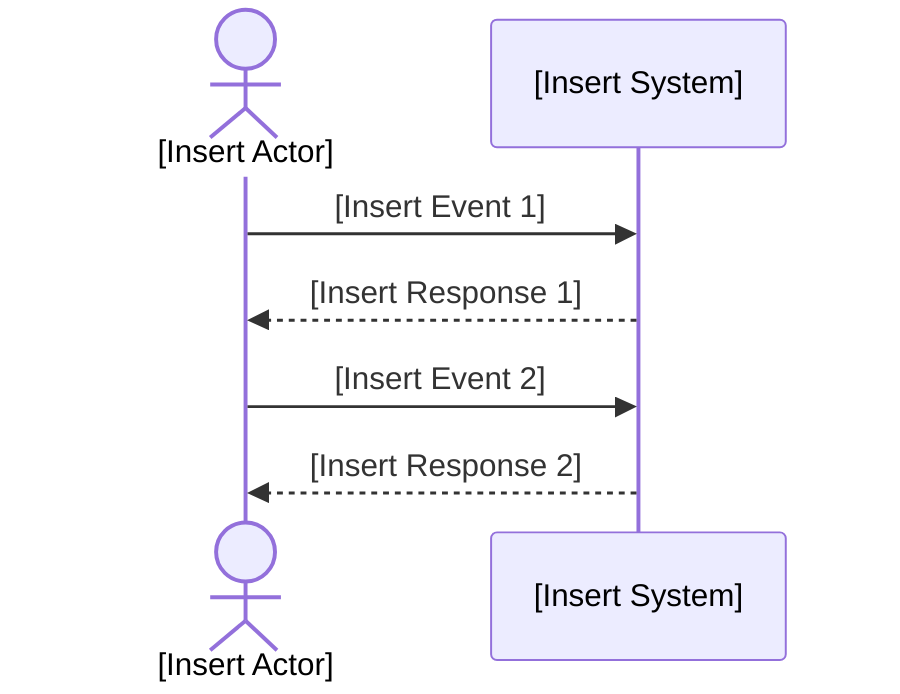

# Quality Criteria: System Sequence Diagram (SSD)
The System Sequence Diagram (SSD) is a visual tool for specifying the sequence of interactions between external actors and the system for a particular use case.
SSDs clarify system boundaries, events, and responses, supporting requirements analysis and design.

## Metadata
| Key               | Value                             |
|-------------------|-----------------------------------|
| Id                | QC-SSD                            |
| crossReference    |                                   |

## Version
- **Version**: 0001
- **Date**: 2026-02-07

### Change Log
| Date       | Version | Description                     | Author        |
|------------|---------|---------------------------------|---------------|
| 2026-02-07 | 0001    | Initial creation of the document |               |

## Quality Criteria for System Sequence Diagram
When evaluating a System Sequence Diagram, consider the following quality criteria:
1. **Clarity and Simplicity**: The SSD should be easy to interpret, with clear actor and system boundaries. Use concise event names and avoid unnecessary complexity.
2. **Completeness**: All relevant interactions for the use case must be included, showing each event and system response.
3. **Relevance**: Events and responses should be specific to the use case and system context.
4. **Consistency**: The SSD should align with use case descriptions and other requirements artifacts.
5. **Visual Appeal**: The diagram should be visually organized, using Mermaid syntax for clarity and reproducibility.

## Common Patterns for SSD Markdown Files

### Filename Convention
- Name files in lowercase, using digits for version, following the pattern: `ssd.uc-yyy.xxxx.md` (e.g., `ssd.uc-001.0001.md`) where `yyy` is the use case number.

### Good Example
```markdown
## Metadata
| Key               | Value                             |
|-------------------|-----------------------------------|
| Id                | SSD                               |
| crossReference    |                                   |

## Version
- **Version**: 0001
- **Date**: [insert todays date]

## Version Log
| Version | Date       | Description              | Author     |
|---------|------------|--------------------------|------------|
| 0001    | [insert todays date] | Initial                  | [insert author name] |


## System Sequence Diagram
```

### Mermaid SSD Template


## Validation
- Review SSDs for completeness, clarity, and correct use of the template.
- Verify that all placeholders are replaced with project-specific content.

## Maintenance
- Update the version and change log for major changes.
- Regularly review SSDs for accuracy and relevance.
