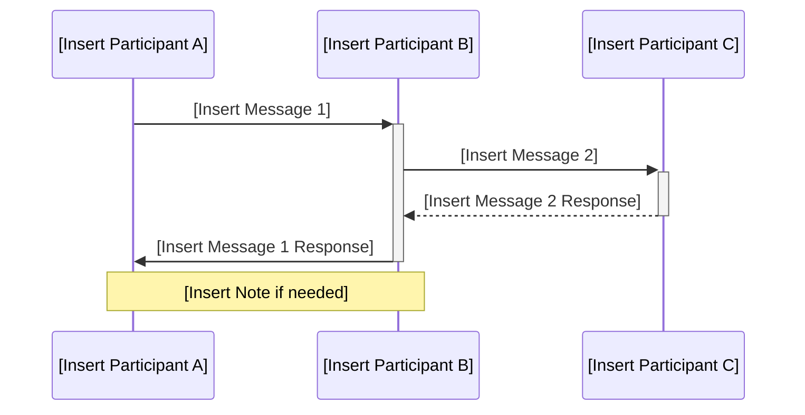

# Quality Criteria: Sequence Diagram
A Sequence Diagram is a type of interaction diagram that shows how processes operate with one another and in what order.
For this project, sequence diagrams must be written in Mermaid syntax for consistency and ease of integration.

## Metadata
| Key               | Value                             |
|-------------------|-----------------------------------|
| Id                | QC-SD                             |
| crossReference    |                                   |

## Version
- **Version**: 0001
- **Date**: 2026-02-07

### Change Log
| Date       | Version | Description                     | Author        |
|------------|---------|---------------------------------|---------------|
| 2026-02-07 | 0001    | Initial creation of the document |               |

## Quality Criteria for Sequence Diagram
When evaluating a Sequence Diagram, consider the following quality criteria:
1. **Clarity and Simplicity**: The diagram should be easy to understand, with clear participant names and concise message descriptions. Avoid jargon and complex language.
1. **Completeness**: Ensure that all relevant participants and interactions are included. The diagram should accurately represent the sequence of operations for the scenario.
1. **Relevance**: The diagram must reflect the specific process or use case being analyzed. Avoid generic or unrelated interactions.
1. **Consistency**: The sequence of messages and participant roles should be logically consistent with the described process.
1. **Visual Appeal**: The diagram should be visually organized and easy to navigate. Use Mermaid's layout features to enhance readability.
1. **Mermaid Syntax**: The diagram must use valid Mermaid sequence diagram syntax.

## Common Patterns for Sequence Diagram Markdown Files

### Filename Convention
- Name files in lowercase, using digits for version, following the pattern: `sd.uc-yyy.xxxx.md` (e.g., `sd.uc-001.0001.md`) where `yyy` is the use case number.

### Good Example
```markdown
## Metadata
| Key               | Value                             |
|-------------------|-----------------------------------|
| Id                | SD                                |
| crossReference    |                                   |

## Version
- **Version**: 0001
- **Date**: [insert todays date]

## Version Log
| Version | Date       | Description              | Author     |
|---------|------------|--------------------------|------------|
| 0001    | [insert todays date] | Initial                  | [insert author name] |

## Sequence Diagram
```

### Mermaid Sequence Diagram Template


## Validation
- Review sequence diagrams for completeness, clarity, and correct use of the Mermaid template.
- Verify that all placeholders are replaced with project-specific content.
- Ensure Mermaid syntax is valid and renders correctly.

## Maintenance
- Update the version and change log for major changes.
- Regularly review sequence diagrams for accuracy and relevance.
