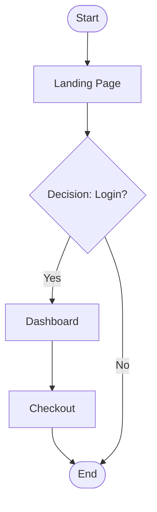

# Quality Criteria: User Flow
A User Flow illustrates the path taken by a user to accomplish a specific goal within a system. 
This document defines quality criteria and a template for documenting user flows in markdown format, using Mermaid for visual diagrams.

## Metadata
| Key               | Value                             |
|-------------------|-----------------------------------|
| Id                | QC-USERFLOW                      |
| crossReference    |                                   |

## Version and Change Log
| Date       | Version | Description                     | Author        |
|------------|---------|---------------------------------|---------------|
| 2026-02-16 | 0001    | Initial creation of the document |               |

## Quality Criteria for User Flow
When evaluating a User Flow, consider the following quality criteria:
1. **Objective & Persona Definition**: Clearly state the specific goal (e.g., checkout) and the user persona performing the action.
2. **Entry Points**: Identify where the user starts their journey (e.g., landing page, email link).
3. **Step & Decision Mapping**: Outline the sequence of screens, user actions (choose/input), and decision points (yes/no). Each step and decision must be clearly labeled.
4. **Flow Types**: Specify the type of flow (chart flow, wire flow, screen flow) and ensure the diagram matches the intended detail level.
5. **Diagram Conventions**: Use standard shapes:
   - **Oval**: Start/End
   - **Rectangle**: Screen/Webpage
   - **Diamond**: Decision point
   - **Arrow**: Direction of flow
6. **Clarity & Simplicity**: The flow must be easy to follow, with concise labels and logical progression. Avoid unnecessary complexity.
7. **Completeness**: All relevant steps, decisions, and possible outcomes must be included.
8. **Relevance**: The flow must reflect the actual user journey for the defined objective and persona.
9. **Consistency**: The flow should be logically consistent and align with related artifacts (e.g., use cases, UI wireframes).
10. **Visual Appeal**: The diagram should be visually organized and easy to navigate. Use Mermaid's layout features to enhance readability.
11. **Mermaid Syntax**: The diagram must use valid Mermaid flowchart syntax.
12. **Test & Refine**: Review the flow for bottlenecks or unnecessary steps, and iterate based on feedback.

## Benefits of User Flows
- **Improved UX**: Ensures a logical, intuitive path that reduces confusion.
- **Enhanced Collaboration**: Provides a shared, visual understanding for designers, developers, and stakeholders.
- **Efficient Development**: Identifies potential issues early, saving time during implementation.

## Example Mermaid User Flow

## Filename Convention
- Name files in lowercase, using digits for version, following the pattern: `userflow.uc-yyy.xxxx.md` (e.g., `userflow.uc-001.0001.md`) where `yyy` is the use case number.
