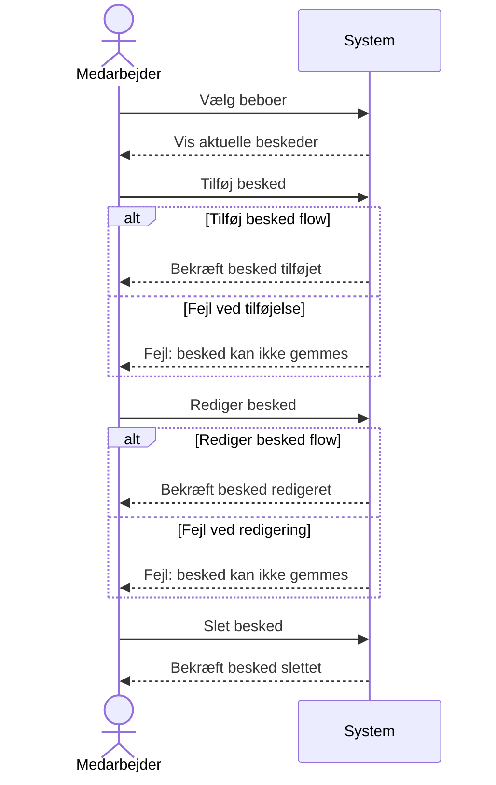

## Metadata
| Nøgle             | Værdi                            |
|-------------------|----------------------------------|
| Id                | SSD-UC-002                       |
| crossReference    | UC-002                           |

## Version
- **Version**: 0001
- **Dato**: 2026-03-06

## Versionslog
| Version | Dato      | Beskrivelse             | Forfatter  |
|---------|-----------|-------------------------|------------|
| 0001    | 2026-03-06| Initial                 | Team 6     |

## Systemsekvensdiagram

