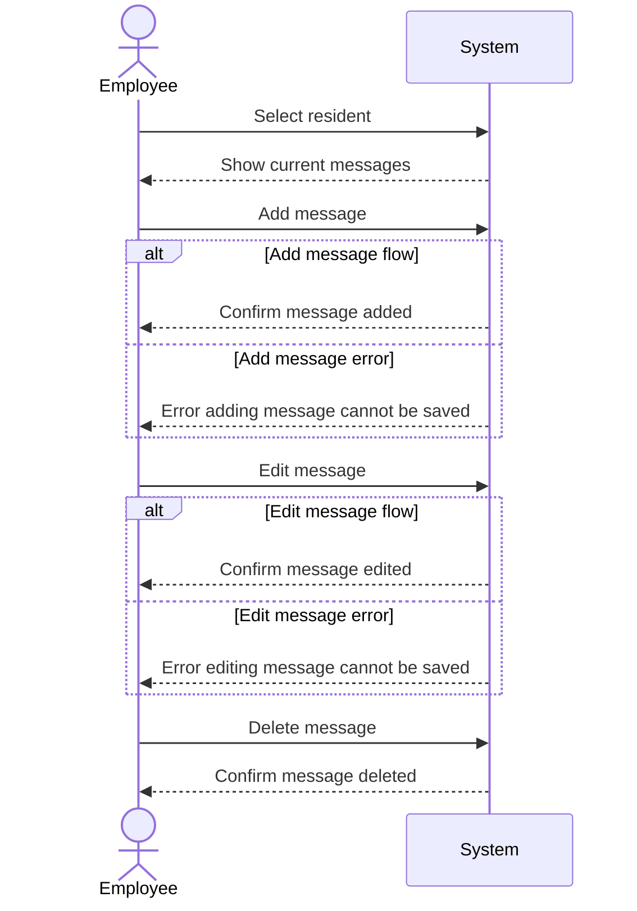

## Metadata
| Key               | Value                             |
|-------------------|-----------------------------------|
| Id                | SSD-UC-002                        |
| crossReference    | UC-002                            |

## Version Log
| Version | Date       | Description              | Author     |
|---------|------------|--------------------------|------------|
| 0001    | 2026-03-06 | Initial                  | Team 6     |

## System Sequence Diagram

