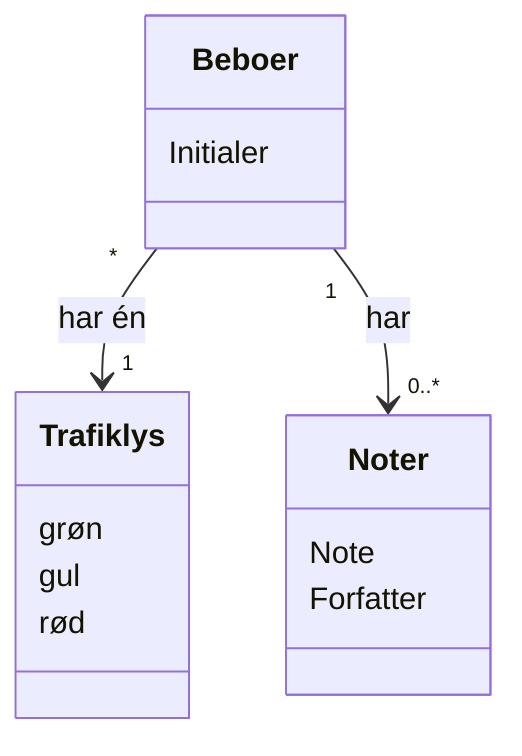

# Domain Model (DM) for Slottets-Drifttavlen Resident Dashboard
## Metadata
| Key               | Value                             |
|-------------------|-----------------------------------|
| Id                | DM                               |
| crossReference    |                                   |

## Version Log
| Version | Date       | Description              | Author     |
|---------|------------|--------------------------|------------|
| 0001    | 2026-02-25 | Initial                  | Team 6     |

## Diagram

## Noter
- Beboer har en trafiklysstatus, som kan være grøn, gul eller rød.
- Beboer kan have flere noter, som indeholder tekst, datotid og forfatterinformation
- Initialer er kun et bogstav fra fornavnet, da ledelsen ønsker at bevare anonymiteten for beboerne. (GDPR-compliant)
 
