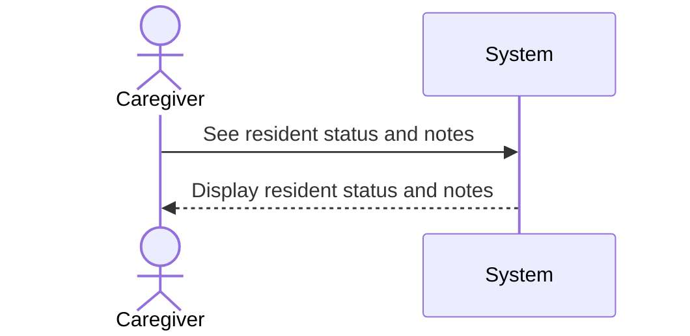

## Metadata
| Key            | Value                        |
|----------------|------------------------------|
| Id             | SSD-001                      |
| crossReference | UC-001                       |

## Version
- **Version**: 0001
- **Date**: 2026-02-25

## Version Log
| Version | Date       | Description              | Author     |
|---------|------------|--------------------------|------------|
| 0001    | 2026-02-25 | Initial                  | Team 6     |

## System Sequence Diagram
<!-- System Sequence Diagram Template: Replace all [Insert ...] placeholders with project-specific content. -->

