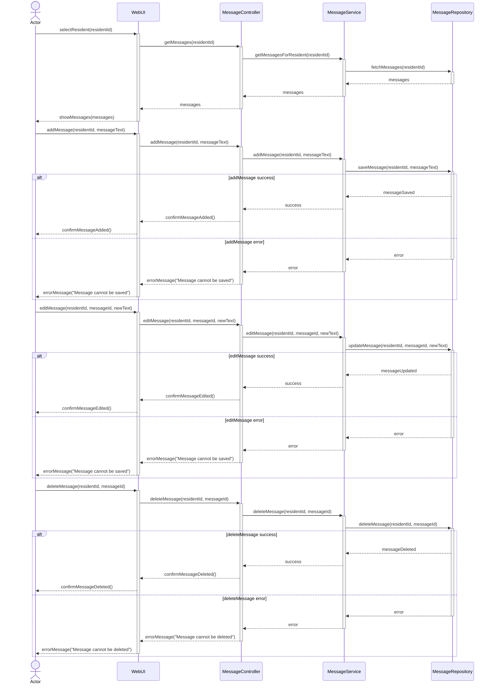

# UC-002 Dashboard Message Sequence Diagram

## Metadata
| Key               | Value                             |
|-------------------|-----------------------------------|
| Id                | SD-UC-002                         |
| crossReference    | SSD-UC-002 / OC-UC-002            |

## Version Log
| Version | Date       | Description              | Author     |
|---------|------------|--------------------------|------------|
| 0002    | 2026-03-06 | New version              | Team 6     |

## Sequence Diagram


**Note:** While Strict UML purists argue that actor is not part of sequence diagram, we can use actor in sequence diagram if it helps to clarify the interactions and roles of different participants in the system. The key is to ensure that the diagram remains clear and easy to understand for all stakeholders even it breaks strict UML rules.

---

**Note on DTOs and Data Transformation:**
- Data Transfer Objects (DTOs) are required between WebUI and backend layers (MessageController, MessageService) to decouple UI models from domain models.
- Example: `addMessage(residentId, messageText)` in WebUI is transformed into an `AddMessageDto` when sent to the controller/service layer.
- Data returned from the repository is mapped to DTOs before being sent to the WebUI.
- All data transformations should be explicit and documented in the implementation.

**DTO Example:**
```csharp
public class AddMessageDto
{
    public int ResidentId { get; set; }
    public string MessageText { get; set; }
}
```
