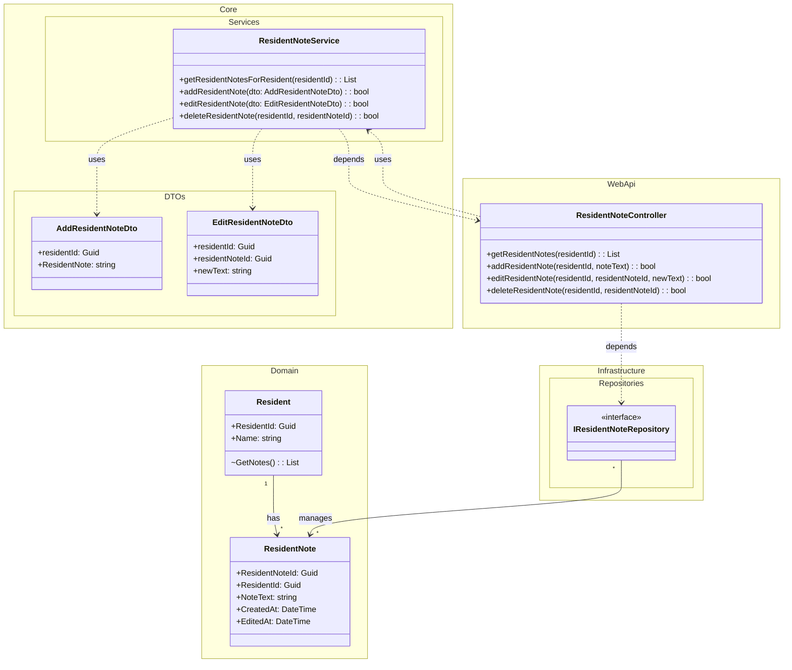

# Domain Class Diagram (DCD) for UC-002 Dashboard ResidentNote

## Metadata
| Key               | Value                             |
|-------------------|-----------------------------------|
| Id                | DCD-002                        |
| crossReference    | SD-002                         |

## Version Log
| Version | Date       | Description                        | Author     |
|---------|------------|------------------------------------|------------|
| 0001    | 2026-03-06 | Initial                            | Team 6     |

## Domain Class Diagram

**Notes:**
- If class names change from previous artifacts, update `/docs/glosery.md` accordingly.
- DTOs (`AddResidentNoteDto`, `EditResidentNoteDto`) are used to decouple UI and domain models.
- Data returned from repository is mapped to DTOs before being sent to WebUI.
- All data transformations are explicit and documented.
- See sequence diagram for interaction details.
- See solutions DCD for repository and interface details.

---

If class names change from previous artifacts, update `/docs/glosery.md` accordingly.
