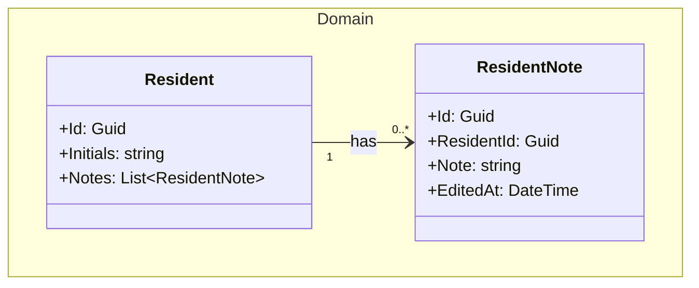
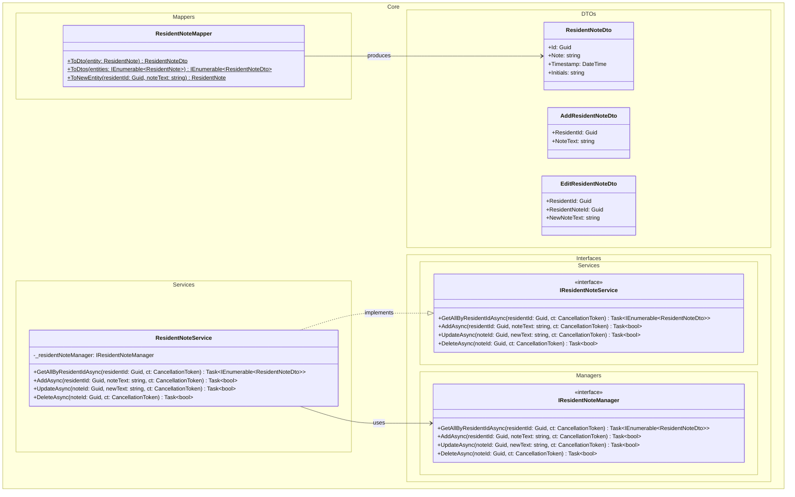
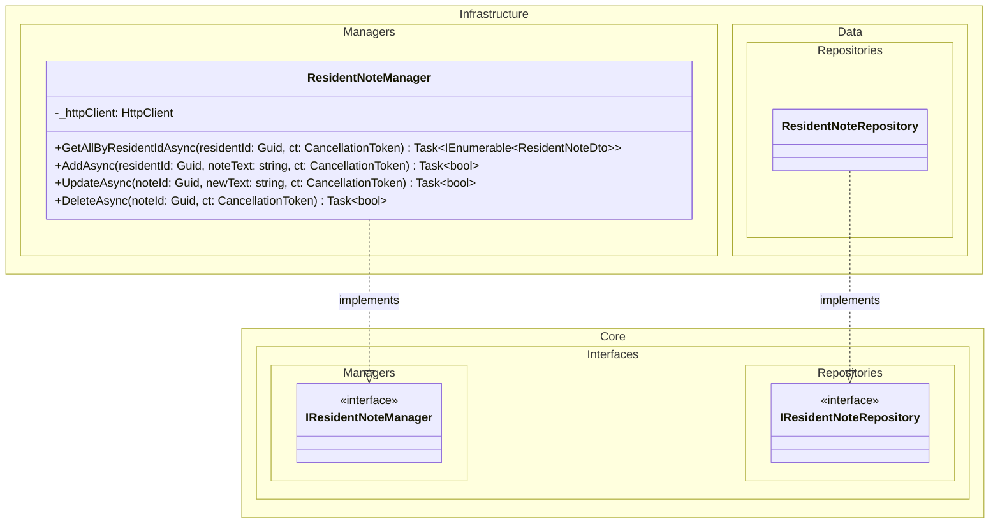
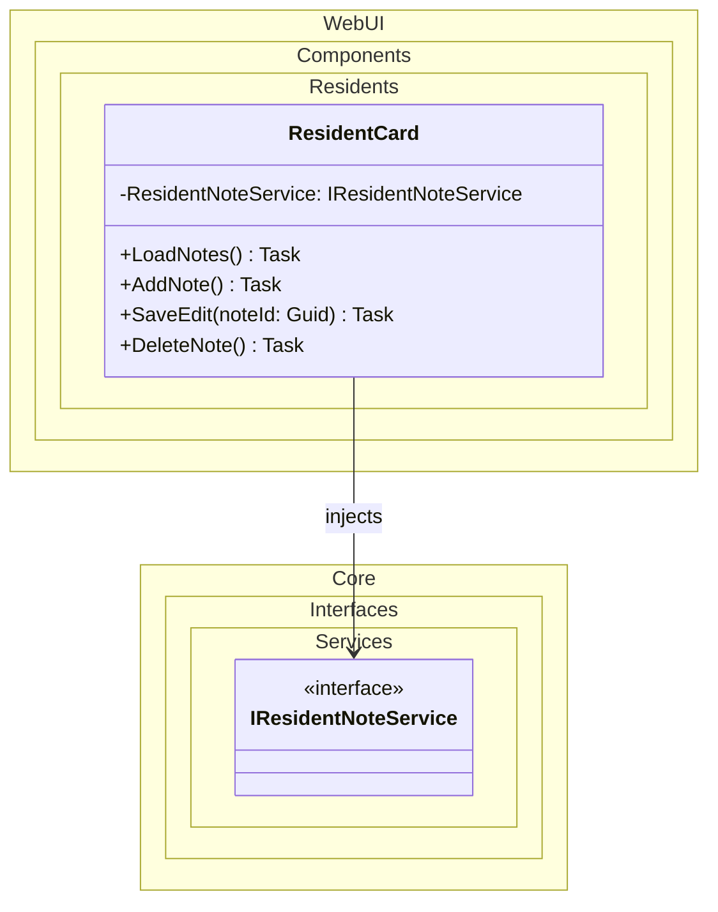

# Domain Class Diagram (DCD) for UC-002 Dashboard ResidentNote

## Metadata
| Key               | Value                             |
|-------------------|-----------------------------------|
| Id                | DCD-002                           |
| crossReference    | SD-002                            |

## Version Log
| Version | Date       | Description                                         | Author |
|---------|------------|-----------------------------------------------------|--------|
| 0001    | 2026-03-06 | Initial                                             | Team 6 |
| 0002    | 2026-04-26 | Add IResidentNoteManager and ResidentNoteManager layer; fix ResidentNoteService dependency | Team 6 |

## Domain Class Diagram

### Domain Layer

### Application Layer

### Infrastructure Layer

### WebUI Layer

## Notes
- ResidentNoteService (Core) delegates all data access to IResidentNoteManager — never to repositories directly.
- ResidentNoteManager (Infrastructure) communicates with the WebApi over HTTP using HttpClient.
- The WebApi controller (ResidentNoteController) accesses data via IResidentNoteRepository in Infrastructure.Data.
- DTOs are used for all cross-layer data transfer — domain entities are never exposed directly.
- ResidentNoteMapper centralises all entity-to-DTO mapping in Core.
