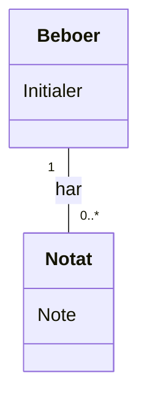

# Domænemodel (DM) for UC-002 Dashboard BeboerNotat
## Metadata
| Nøgle               | Værdi                             |
|---------------------|-----------------------------------|
| Id                  | UC-002.DM                        |
| crossReference      | BC, DM                           |

## Versionslog
| Version | Dato       | Beskrivelse              | Forfatter     |
|---------|------------|--------------------------|---------------|
| 0001    | 2026-06-08 | Initial, henviser til løsnings-DM | Team 6        |

## Diagram

## Noter
- Løsningsdomænemodellen (`docs/dm.0001.da.md`) dækker fuldt ud domænemodellen for dette use case. Se Beboer og Notat entiteterne og deres relation i løsnings-DM.
- Eventuelle fremtidige ændringer i domænemodellen for dette use case skal afspejles i løsnings-DM.

## Termoversættelse
| Engelsk         | Dansk        |
|-----------------|--------------|
| Resident        | Beboer       |
| ResidentNote    | Notat        |
| Initials        | Initialer    |
| Note            | Note         |
