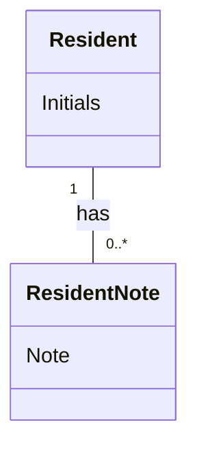

# Domain Model (DM) for UC-002 Dashboard ResidentNote
## Metadata
| Key               | Value                             |
|-------------------|-----------------------------------|
| Id                | UC-002.DM                        |
| crossReference    | BC, DM                           |

## Version Log
| Version | Date       | Description              | Author     |
|---------|------------|--------------------------|------------|
| 0001    | 2026-06-08 | Initial, references solution DM | Team 6     |

## Diagram

## Notes
- The solution-level domain model (`docs/dm.0001.md`) fully covers the domain model for this use case. See the Resident and ResidentNote entities and their relationship in the solution DM.
- Any future changes to the domain model for this use case must be reflected in the solution DM.
