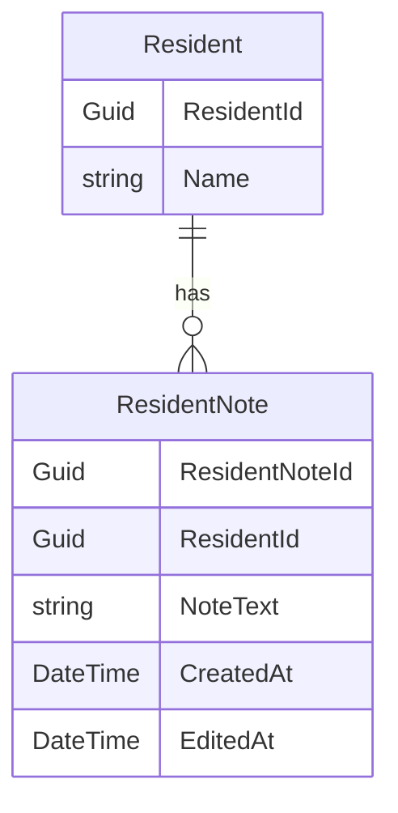

# Entity Relationship Diagram (ERD) for UC-002 Dashboard ResidentNote
## Metadata
| Key               | Value                             |
|-------------------|-----------------------------------|
| Id                | ERD-002                        |
| crossReference    | DCD-002                        |

## Version Log
| Version | Date       | Description                        | Author     |
|---------|------------|------------------------------------|------------|
| 0001    | 2026-03-06 | Initial                            | Team 6     |

## Entity Relationship Diagram

**Notes:**
- All placeholders have been replaced with UC-002 specific content.
- Entities, attributes, and relationships are clearly defined.
- See DCD for domain class details.
- Only the latest version is kept in the main branch.
