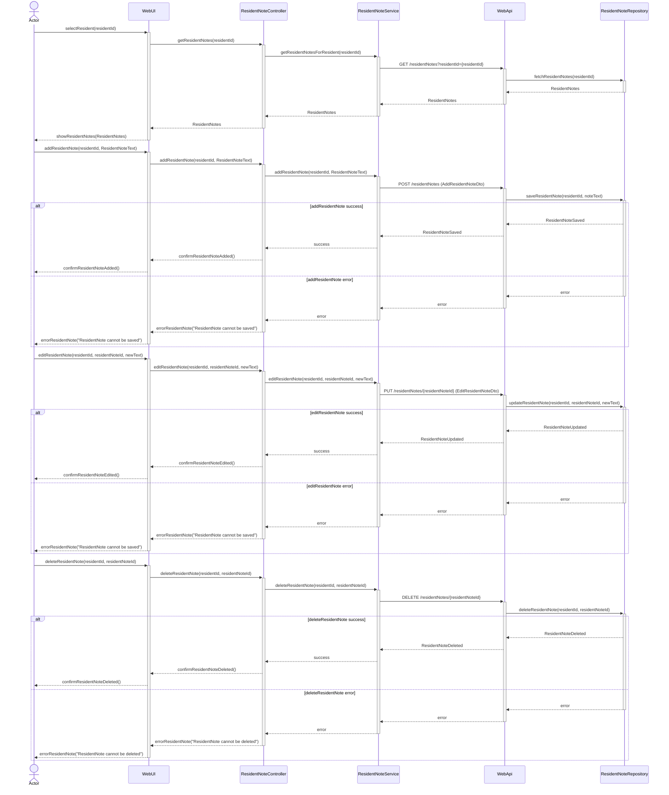

# UC-002 Dashboard ResidentNote Sequence Diagram

## Metadata
| Key               | Value                             |
|-------------------|-----------------------------------|
| Id                | SD-UC-002                         |
| crossReference    | SSD-UC-002 / OC-UC-002            |

## Version Log
| Version | Date       | Description              | Author     |
|---------|------------|--------------------------|------------|
| 0003    | 2026-06-07 | Update: use WebApi for CRUD | Team 6     |

## Sequence Diagram


**Note:** While Strict UML purists argue that actor is not part of sequence diagram, we can use actor in sequence diagram if it helps to clarify the interactions and roles of different participants in the system. The key is to ensure that the diagram remains clear and easy to understand for all stakeholders even it breaks strict UML rules.

---

**Note on DTOs and Data Transformation:**
- Data Transfer Objects (DTOs) are required between WebUI and WebApi to decouple UI models from domain models.
- Example: `addResidentNote(residentId, ResidentNoteText)` in WebUI is transformed into an `AddResidentNoteDto` when sent to the WebApi.
- Data returned from the database is mapped to DTOs before being sent to the WebUI.
- All data transformations should be explicit and documented in the implementation.

**DTO Example:**
```csharp
public class AddResidentNoteDto
{
    public int residentId { get; set; }
    public string ResidentNote { get; set; }
}
```
