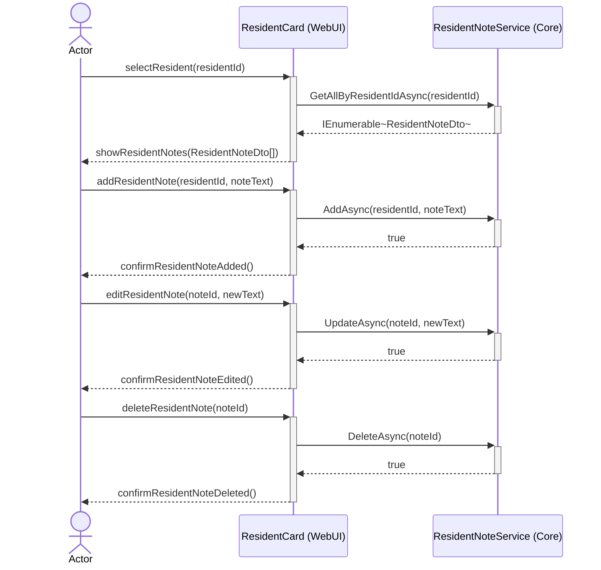
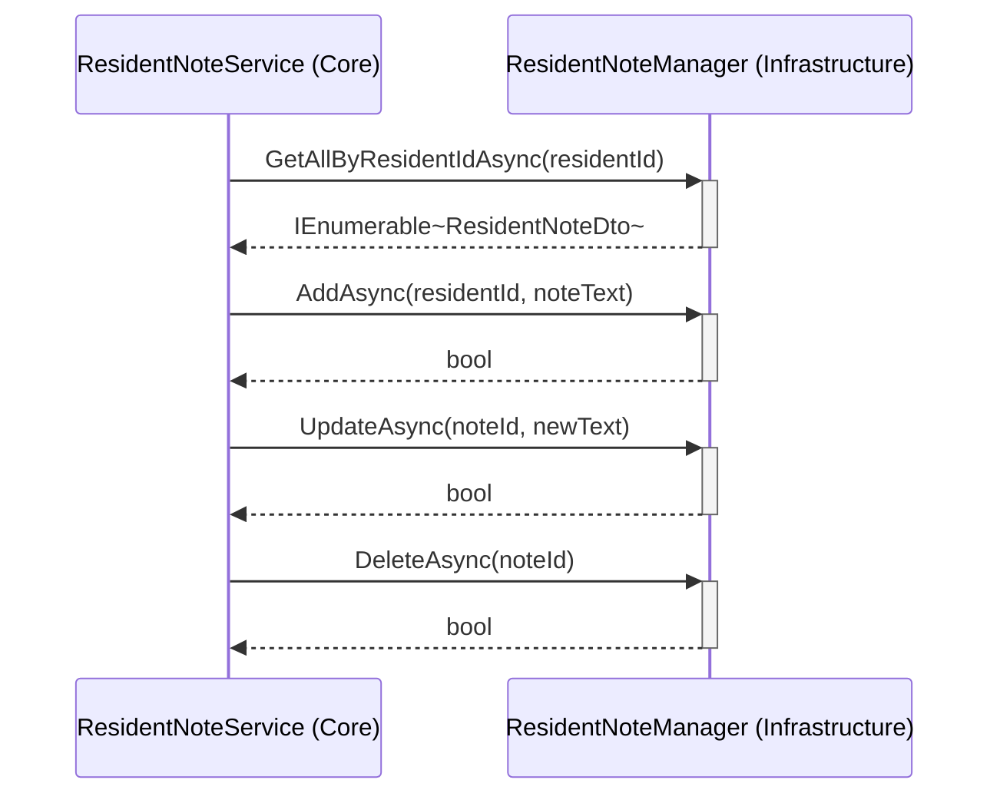
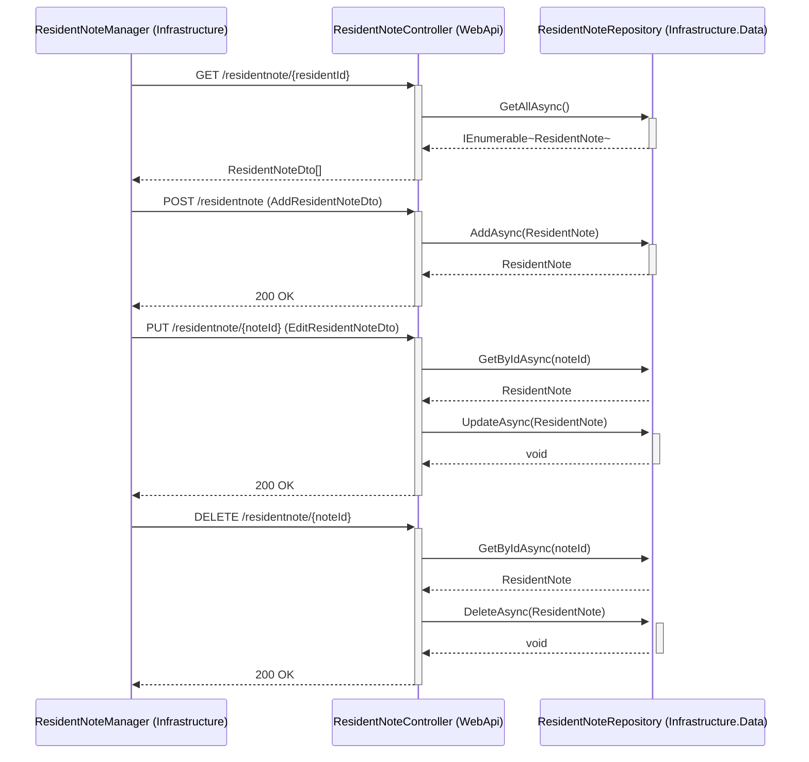

# UC-002 Dashboard ResidentNote Sequence Diagram

## Metadata
| Key            | Value                    |
|----------------|--------------------------|
| Id             | UC-002.SD                |
| crossReference | UC-002.SSD UC-002.OC UC-002.DCD |

## Version Log
| Version | Date       | Description                                              | Author |
|---------|------------|----------------------------------------------------------|--------|
| 0001    | 2026-03-06 | Initial                                                  | Team 6 |
| 0002    | 2026-03-07 | Add edit and delete flows                                | Team 6 |
| 0003    | 2026-03-07 | Update: use WebApi for CRUD                              | Team 6 |
| 0004    | 2026-03-24 | Change to WebApi→Infrastructure Data Access diagram      | Team 6 |
| 0005    | 2026-04-26 | Sync with implementation: add IResidentNoteManager layer | Team 6 |

## Sequence Diagram

### Presentation Layer → Application Layer

### Application Layer → Infrastructure Layer (External Interfaces)

### WebApi Layer → Infrastructure Layer (Data Access)

## Notes
- WebUI (ResidentCard) never calls the API directly — always via IResidentNoteService.
- ResidentNoteService (Core) delegates all HTTP communication to IResidentNoteManager (Core interface), implemented by ResidentNoteManager in Infrastructure.
- ResidentNoteManager uses HttpClient with the named client 'SlottetApi' to call WebApi endpoints.
- ResidentNoteController (WebApi) accesses data via IResidentNoteRepository — never via services.
- DTOs are used for all cross-layer data transfer. Domain entities are never exposed outside Infrastructure.Data.
