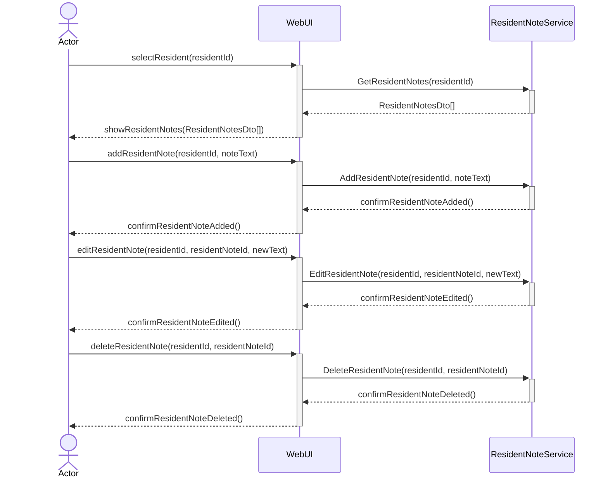
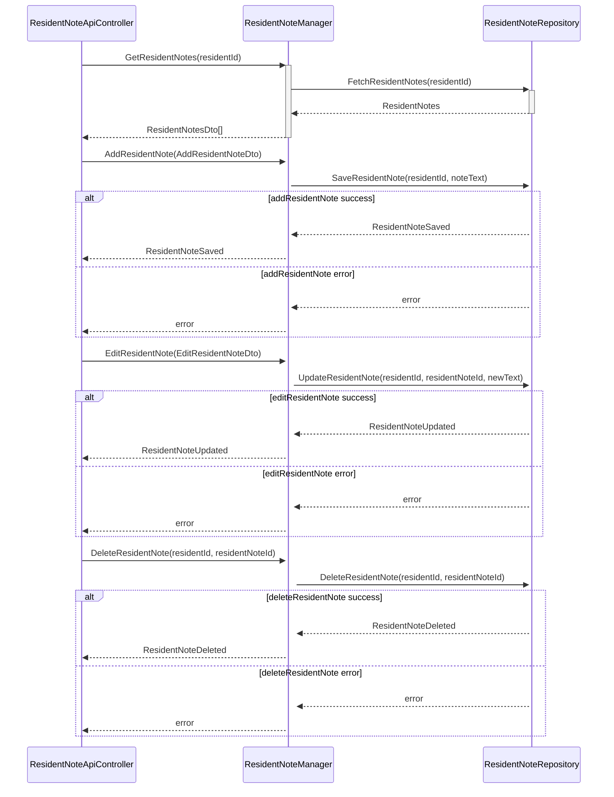
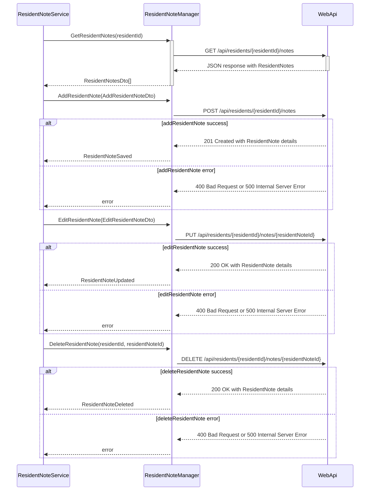

# UC-002 Dashboard ResidentNote Sequence Diagram

## Metadata
| Key            | Value           |
|----------------|-----------------|
| Id             | UC-002.SD       |
| crossReference | UC-002.SSD UC-002.OC |

## Version Log
| Version | Date       | Description                        | Author |
|---------|------------|------------------------------------|--------|
| 0003    | 2026-03-07 | Update: use WebApi for CRUD        | Team 6 |
| 0004    | 2026-03-24 | Change to WebApi→Infrastructure Data Access diagram | Team 6 |

## Sequence Diagram


### Presentation Layer → Application Layer



### WebApi Layer → Infrastructure Layer (Data Access)



### Application Layer → Infrastructure Layer (WebAPI)


---


**Notes:**
- The WebUI never calls the controller or data access directly; it always calls the Application layer (Service/Handler), which orchestrates all business logic and data access.
- Data Transfer Objects (DTOs) are used between layers to decouple UI and domain models.
- Example: `AddResidentNote(residentId, noteText)` in WebUI is transformed into an `AddResidentNoteDto` when sent to the Application layer, which then passes it to the WebApi.
- Data returned from the database is mapped to DTOs before being sent to the WebUI.
- All data transformations are explicit and documented in the implementation.

**DTO Example:**
```csharp
public class AddResidentNoteDto
{
    public int ResidentId { get; set; }
    public string ResidentNote { get; set; }
}
```
