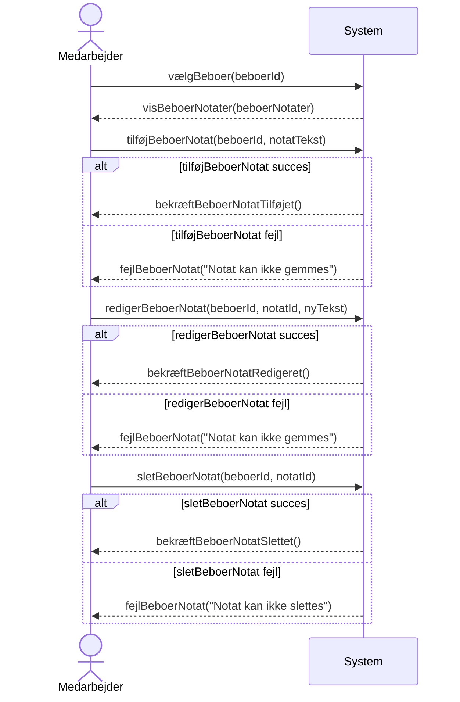

# System Sequence Diagram: UC-002 Resident Note Management
## Metadata
| Nøgle            | Værdi           |
|------------------|-----------------|
| Id               | UC-002.SSD      |
| crossReference   | UC-002 UC-002.DM|

## Versionslog
| Version | Dato       | Beskrivelse | Forfatter |
|---------|------------|-------------|-----------|
| 0001    | 2026-03-06 | Initial     | Team 6 |
| 0002    | 2026-03-24 | Apply QC    | Team 6 |

## Systemsekvensdiagram

