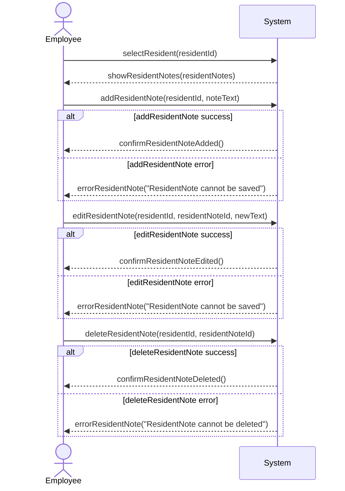

# Systen Sequence Diagram for Use Case UC-002: Manage Resident Notes
## Metadata
| Key            | Value           |
|----------------|-----------------|
| Id             | UC-002.SSD      |
| crossReference | UC-002 UC-002.DM|

## Version Log
| Version | Date       | Description | Author |
|---------|------------|-------------|--------|
| 0001    | 2026-03-06 | Initial     | Team 6 |
| 0002    | 2026-03-24 | Apply QC    | Team 6 |

## System Sequence Diagram

