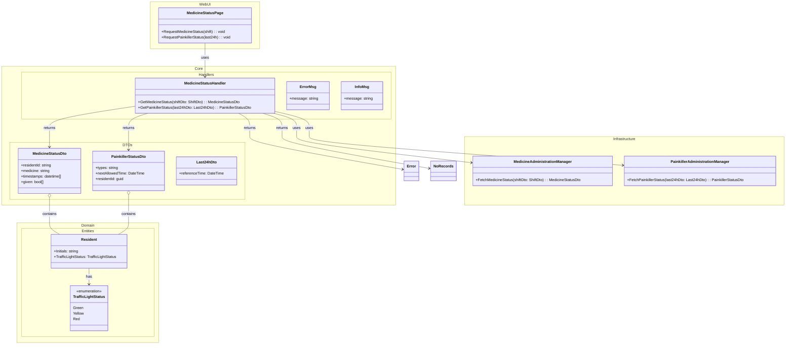

## Diagram for Medicine and Painkiller Status

## Notes
- DTOs are used for data transfer between layers.
- Manager classes abstract infrastructure details (e.g., database, API).
- All dependencies point inward, following Clean Architecture.
- Resident and TrafficLightStatus reused from solution DCD.
- All placeholders replaced; diagram follows latest template and quality criteria.

---
