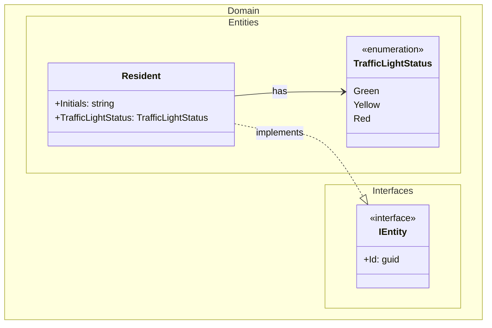
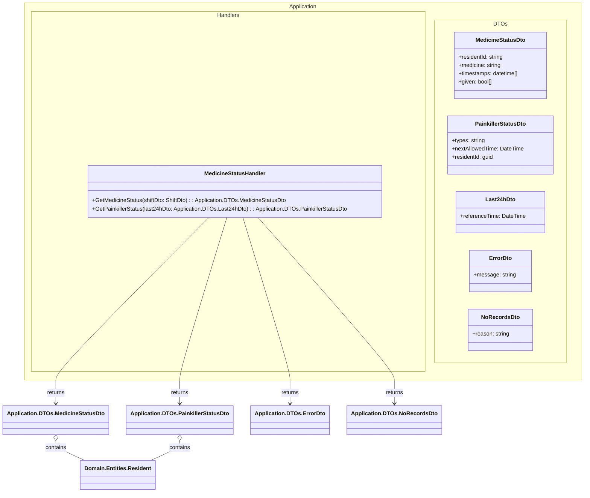
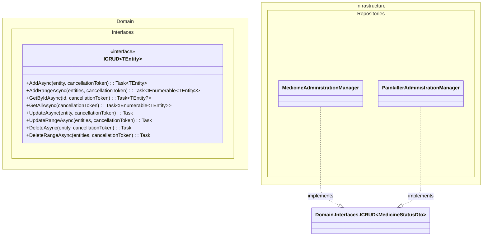

## DCD for Domain Layer

## DCD for Application Layer

## DCD for Infrastructure Layer

## Notes

Notes:
- This DCD is split into Domain, Application, and Infrastructure sections, following Clean Architecture and project documentation standards.
- Infrastructure managers now implement the ICRUD interface, matching repository CRUD standards.
- Namespaces and references are fully qualified for clarity and traceability.
- DTOs are used for data transfer between layers.
- Manager classes abstract infrastructure details (e.g., database, API).
- All dependencies point inward, following Clean Architecture.
- Resident and TrafficLightStatus reused from solution DCD.
- All placeholders replaced; diagram follows latest template and quality criteria.

---
