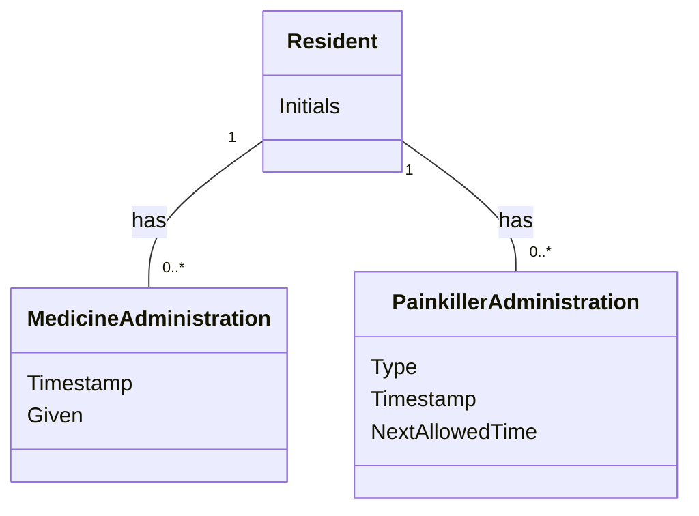

# Domain Model (DM) for Medicine and Painkiller Status Overview
## Metadata
| Key               | Value                             |
|-------------------|-----------------------------------|
| Id                | UC-003.DM                        |
| crossReference    | BC                                |

## Version Log
| Version | Date       | Description              | Author     |
|---------|------------|--------------------------|------------|
| 0001    | 2026-03-22 | Initial                  | Team 6     |

## Diagram

## Assumptions and Dependencies
- Each Resident can have multiple medicine and painkiller administration records.
- Painkiller types are predefined and validated.
- Initials are used for resident identification to ensure GDPR compliance.

## Terms Translation

| Original Term           | Danish Translation         |
|------------------------|---------------------------|
| Resident               | Beboer                    |
| MedicineAdministration | Medicinadministration      |
| PainkillerAdministration | Smertestillendeadministration |
| Timestamp              | Tidsstempel               |
| Shift                  | Vagt                      |
| Given                  | Givet                     |
| Type                   | Type                      |
| NextAllowedTime        | NæsteTilladteTidspunkt     |
| Initials               | Initialer                 |

## Notes
- The model supports tracking medicine and painkiller administration for all residents, including shift and timing details.
- The system must handle errors and missing data gracefully as described in the use case.
