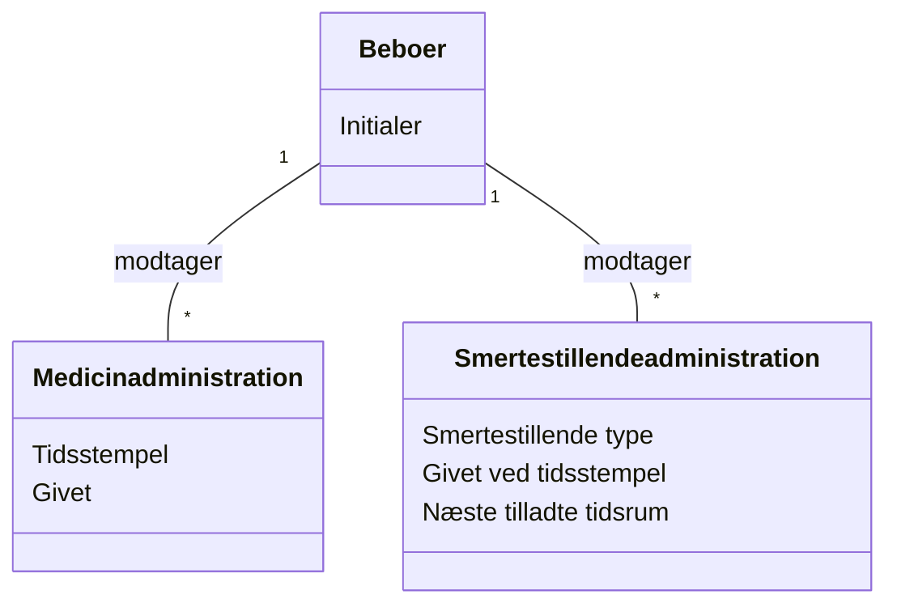

# Domainemodel (DM) for Slottets Drifttavlen
## Metadata
| Nøgle             | Værdi                             |
|-------------------|-----------------------------------|
| Id                | UC-003.DM                         |
| krydsreference    | BC                                |

## Version Log
| Version | Dato       | Beskrivelse              | Forfatter  |
|---------|------------|--------------------------|------------|
| 0002    | 2026-03-20 | Synkroniseret med engelsk DM | Team 6     |

## Diagram

## Antagelser og afhængigheder
- Medicinadministration poster filtreres for de sidste 24 timer.
- Smertestillendeadministration er en specialiseret post knyttet til medicinadministration.
- Dashboard viser status for alle beboere.

## Terms Translation
| Original Term           | Dansk oversættelse         |
|------------------------|---------------------------|
| Resident               | Beboer                    |
| MedicineAdministration | Medicinadministration      |
| PainkillerAdministration| Smertestillendeadministration |
| Timestamp              | Tidsstempel                |
| WasGiven               | Givet                     |
| PainkillerType         | Smertestillende type       |
| WasGivenAtTimestamp    | Givet ved tidsstempel      |
| NextAllowedTimespan    | Næste tilladte tidsrum     |
