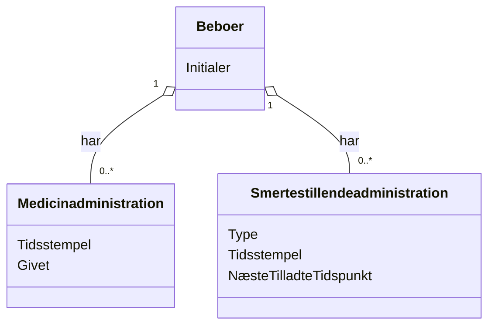

# Domænemodel (DM) for Medicin- og Smertestillende Statusoversigt
## Metadata
| Nøgle               | Værdi                             |
|---------------------|-----------------------------------|
| Id                  | UC-003.DM                        |
| crossReference      | BC                                |

## Versionslog
| Version | Dato       | Beskrivelse              | Forfatter     |
|---------|------------|--------------------------|---------------|
| 0001    | 2026-03-22 | Initial                  | Team 6        |

## Diagram

## Antagelser og Afhængigheder
- Hver beboer kan have flere medicin- og smertestillende administrationsposter.
- Typer af smertestillende er foruddefinerede og valideres.
- Initialer bruges til beboeridentifikation for at sikre GDPR-overholdelse.

## Termoversættelse

| Original Term           | Dansk Oversættelse         |
|------------------------|---------------------------|
| Resident               | Beboer                    |
| MedicineAdministration | Medicinadministration      |
| PainkillerAdministration | Smertestillendeadministration |
| Timestamp              | Tidsstempel               |
| Given                  | Givet                     |
| Type                   | Type                      |
| NextAllowedTime        | NæsteTilladteTidspunkt     |
| Initials               | Initialer                 |

## Noter
- Modellen understøtter sporing af medicin- og smertestillende administration for alle beboere, inkl. vagt- og tidsdetaljer.
- Systemet skal håndtere fejl og manglende data som beskrevet i use casen.
