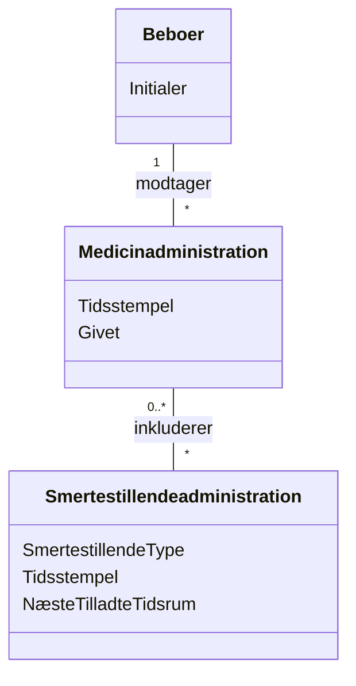

# Domain Model (DM) for Slottets Drifttavlen
## Metadata
| Key               | Value                             |
|-------------------|-----------------------------------|
| Id                | UC-003.DM                         |
| crossReference    | BC                                |

## Version Log
| Version | Date       | Description              | Author     |
|---------|------------|--------------------------|------------|
| 0001    | 2026-03-20 | Initial                  | Team 6     |

## Diagram

## Antagelser og afhængigheder
- Medicinadministration poster filtreres for de sidste 24 timer.
- Smertestillendeadministration er en specialiseret post knyttet til medicinadministration.
- Dashboard viser status for alle beboere.

## Terms Translation
| Original Term           | Danish Translation         |
|------------------------|---------------------------|
| Resident               | Beboer                    |
| MedicineAdministration | Medicinadministration      |
| PainkillerAdministration| Smertestillendeadministration |
| Timestamp              | Tidsstempel                |
| WasGiven               | Givet                     |
| PainkillerType         | Smertestillende type       |
| NextAllowedTimespan    | Næste tilladte tidsrum     |
