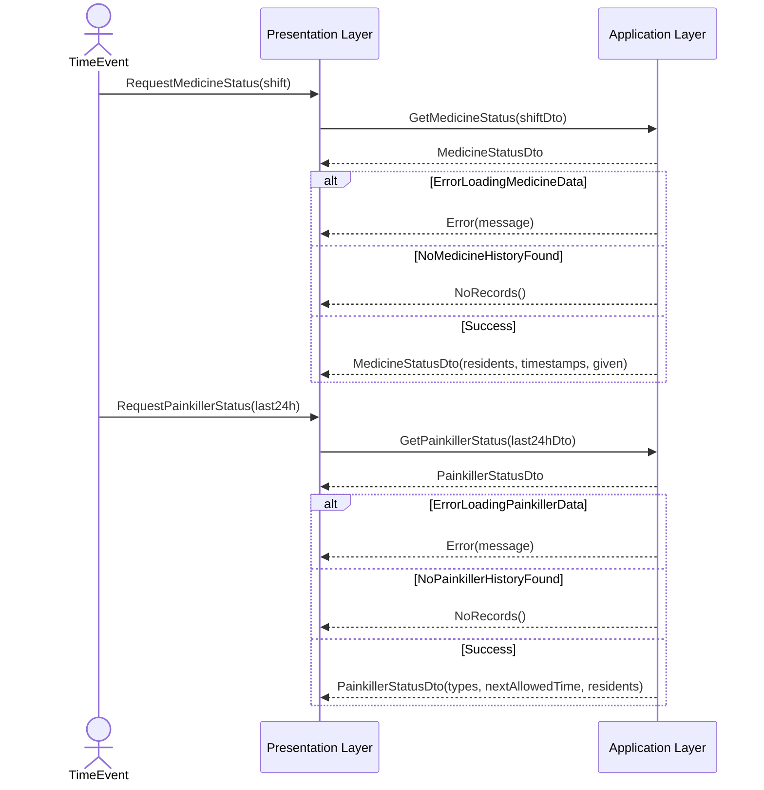
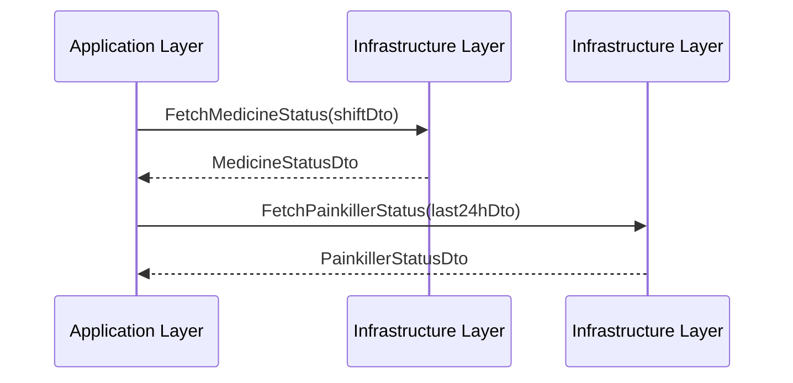

# Sequence Diagram for UC-003: Medicine and Painkiller Status Overview
## Metadata
| Key            | Value           |
|----------------|-----------------|
| Id             | UC-003.SD       |
| crossReference | UC-003          |

## Version Log
| Version | Date       | Description           | Author |
|---------|------------|-----------------------|--------|
| 0001    | 2026-03-22 | Initial SD creation   | Team 6 |

## Sequence Diagram: Medicine and Painkiller Status Overview

### Presentation → Application

### Application → Infrastructure

## Notes
- DTOs are used for data transfer between layers.
- Manager classes abstract infrastructure details (e.g., database, API).
- All dependencies point inward, following Clean Architecture.

## Compliance
- Follows SD agent and Clean Architecture instructions.
- Version log maintained.

## Language Handling
Professional English for metadata and versioning; domain language in diagram content.
