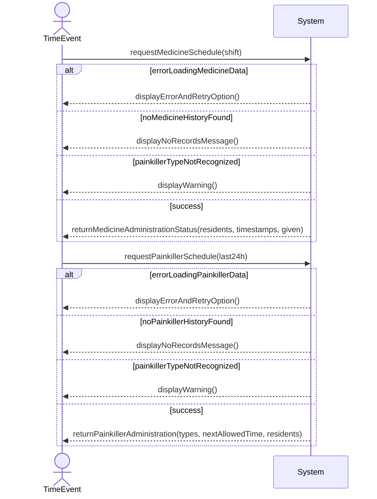

## Metadata
| Key            | Value                       |
|----------------|-----------------------------|
| Id             | UC-003.SSD                  |
| crossReference | UC-003 UC-003.DM            |

## Version Log
| Version | Date       | Description | Author |
|---------|------------|-------------|--------|
| 0001    | 2026-03-22 | Initial     | Team 6 |

## System Sequence Diagram

## Language Translation

| Original Term               | Danish Translation              |
|----------------------------|---------------------------------|
| Resident                   | Beboer                          |
| MedicineAdministration     | Medicinadministration           |
| PainkillerAdministration   | Smertestillendeadministration   |
| Timestamp                  | Tidsstempel                     |
| Shift                      | Vagt                            |
| Given                      | Givet                           |
| Type                       | Type                            |
| NextAllowedTime            | NæsteTilladteTidspunkt          |
| Initials                   | Initialer                       |
