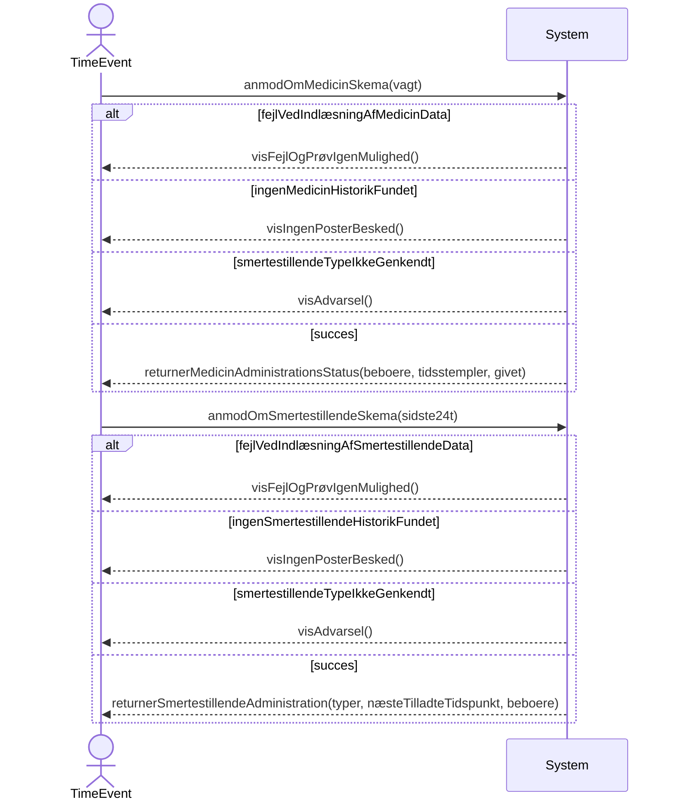

# Systemsekvensdiagram for Medicinadministrationsstatus og Smertestillendeadministration
## Metadata
| Nøgle            | Værdi                       |
|------------------|-----------------------------|
| Id               | UC-003.SSD                  |
| crossReference   | UC-003 UC-003.DM            |

## Versionslog
| Version | Dato       | Beskrivelse | Forfatter |
|---------|------------|-------------|-----------|
| 0001    | 2026-03-22 | Initial     | Team 6    |

## Systemsekvensdiagram

## Termoversættelse

| Original Term               | Dansk Oversættelse              |
|----------------------------|---------------------------------|
| Resident                   | Beboer                          |
| MedicineAdministration     | Medicinadministration           |
| PainkillerAdministration   | Smertestillendeadministration   |
| Timestamp                  | Tidsstempel                     |
| Shift                      | Vagt                            |
| Given                      | Givet                           |
| Type                       | Type                            |
| NextAllowedTime            | NæsteTilladteTidspunkt          |
| Initials                   | Initialer                       |
