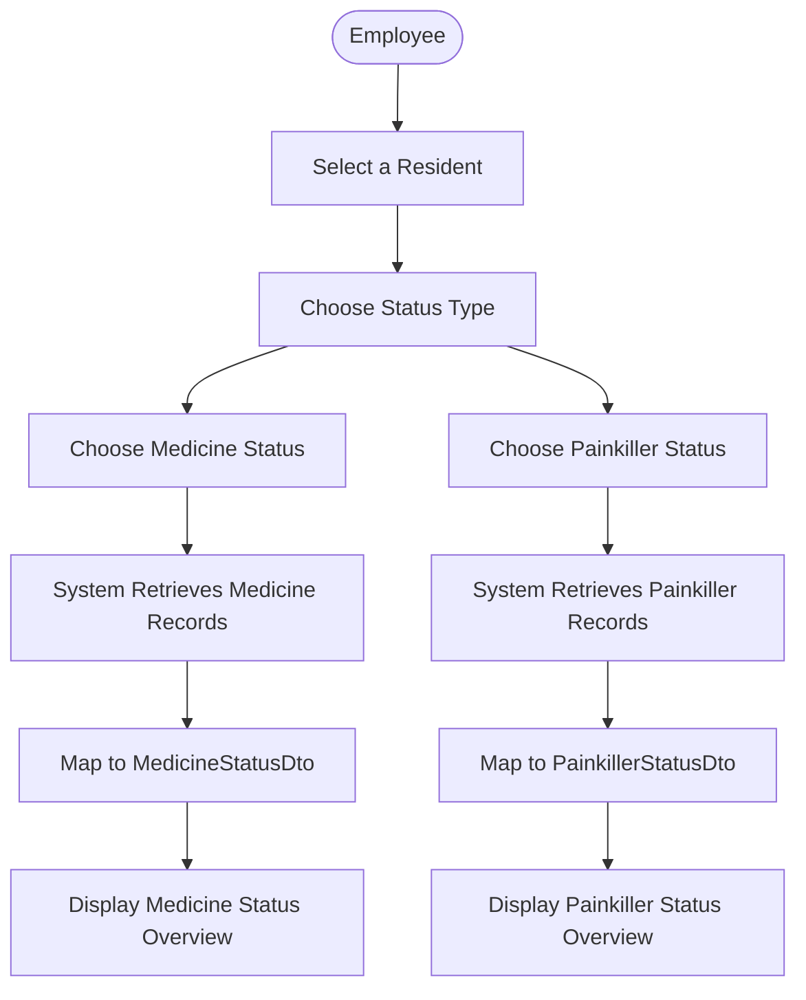

# User Flow Diagram: Medicine and Painkiller Status Overview

## Metadata
| Key               | Value                             |
|-------------------|-----------------------------------|
| Id                | UC-003.UFD                        |
| crossReference    | UC-003                            |

## Version Log
| Version | Date       | Description              | Author     |
|---------|------------|--------------------------|------------|
| 0001    | 2026-04-23 | Initial                  | Team 6     |

## User Flow Diagram

### Primary Flow
 1. The employee selects a resident  
 2. The employee chooses medicine status  
 3. The system retrieves medicine records for the selected resident from the last 24 hours  
 4. The system maps the records to a medicine status DTO  
 5. The system displays the medicine status overview  

---

### Painkiller Status Flow
 1a. The employee selects a resident  
 2a. The employee chooses painkiller status  
 3a. The system retrieves painkiller records for the selected resident  
 4a. The system maps the records to a painkiller status DTO
 5a. The system displays the painkiller status overview  

---

# User Flow Diagram (Visual)

## Notes

-This user flow diagram illustrates the process for a user to view the medicine and painkiller status of a resident. 
-The user starts by opening the system and selecting a resident, then chooses whether to view medicine status or painkiller status. 
-Depending on the selection, the appropriate API endpoint is called, data is fetched from the repository, mapped to a DTO, and returned as a response to be displayed to the user.

---
