```mermaid
%% DCD for Use Case 004: User Login
classDiagram
  direction TB

  namespace Core.Domain {
    class User {
      <<extends Microsoft.AspNetCore.Identity.IdentityUser>>
    }
  }

  namespace Core.Services {
    class AccountService {
      +LoginAsync(username: string, password: string): LoginResult
    }
    class NotificationHandler {
      +Info(message: string)
      +Error(message: string)
    }
  }

  namespace Core.DTOs.Account {
    class LoginRequestDto {
      +Username: string
      +Password: string
    }
    class LoginResponseDto {
      +JwtToken: string "nullable"
      +RefreshToken: string "nullable"
      +ErrorMessage: string "nullable"
    }
    class LogoutRequestDto {
      +JwtToken: string
    }
    class LogoutResponseDto {
      +IsSuccessful: bool
      +ErrorMessage: string "nullable"
    }
    class RefreshTokenRequestDto {
      +RefreshToken: string
    }
    class RefreshTokenResponseDto {
      +JwtToken: string "nullable"
      +RefreshToken: string "nullable"
      +ErrorMessage: string "nullable"
    }
    class RegistrationRequestDto {
      +EmailAddress: string
      +ConfirmPassword: string
      +Password: string
    }
    class RegistrationResponseDto {
      +IsSuccessful: bool
      +ErrorMessage: string "nullable"
    }
  }

  namespace Infrastructure.Identity {
    class AccountManager {
      +AuthenticateAsync(username: string, password: string): AuthResult
      +GenerateJwtToken(user: object): string
    }
  }

  namespace WebApi.Controllers {
    class LoginApiController {
      +Login(CredentialsDto): LoginResult
    }
  }

  %% External dependencies (Identity framework abstractions)
  class Microsoft.AspNetCore.Identity.SignInManager {
    <<external>>
  }
  class Microsoft.AspNetCore.Identity.UserManager {
    <<external>>
  }
  class System.IdentityModel.Tokens.Jwt.JwtSecurityTokenHandler {
    <<external>>
  }

  %% Associations
  LoginApiController --> AccountManager : uses
  LoginApiController --> AccountService : uses
  AccountService --> AccountManager : authenticates
  AccountService --> NotificationHandler : notifies
  AccountService --> LoginResult : returns
  AccountManager ..> Microsoft.AspNetCore.Identity.SignInManager : depends
  AccountManager ..> Microsoft.AspNetCore.Identity.UserManager : depends
  AccountManager ..> System.IdentityModel.Tokens.Jwt.JwtSecurityTokenHandler : depends
  AccountService --> LoginRequestDto : receives
  AccountManager --> LoginResponseDto : returns
  AccountManager --> LoginResult : issues
  NotificationHandler --> AccountService : notifies

  %% Notes
  %% - AccountManager abstracts Identity framework (SignInManager, UserManager, JwtSecurityTokenHandler)
  %% - No domain entity fields from Identity are duplicated in domain models
  %% - NotificationHandler is used for UI feedback
```

# Domain Class Diagram (DCD) for Use Case 004: User Login
## Metadata
| Key               | Value                             |
|-------------------|-----------------------------------|
| Id                | UC-004.DCD                        |
| crossReference    | UC-004.SD UC-004.OC            |

## Version Log
| Version | Date       | Description              | Author     |
|---------|------------|--------------------------|------------|
| 0001    | 2026-03-30 | Initial                  | Team 6     |

---

---

## Notes
- AccountManager abstracts all authentication logic and Identity framework dependencies.
- No domain entity fields from Identity are duplicated in domain models.
- NotificationHandler is responsible for publishing Info and Error messages to the UI.
- DTOs are used for credential transfer and login results.
