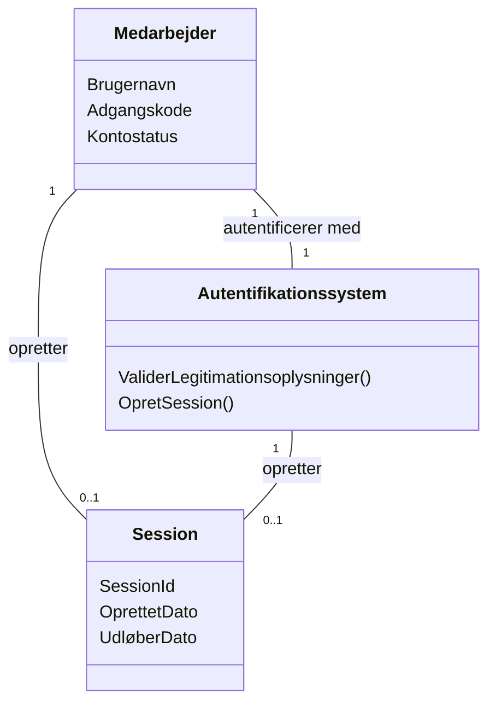

# Domænemodel (DM) for Slottets Drifttavlen - Brugerlogin
## Metadata
| Nøgle              | Værdi                             |
|--------------------|-----------------------------------|
| Id                 | UC-004.DM                         |
| crossReference     | BC   REQ-F-005                 |

## Versionslog
| Version | Dato       | Beskrivelse              | Forfatter  |
|---------|------------|--------------------------|------------|
| 0001    | 2026-03-30 | Initial                  | Team 6     |

## Diagram

## Noter
 # Validering
 Valideret for:
 - Skabelonoverholdelse (metadata, versionslog, diagram, noter)
 - Struktur og navngivningskonventioner
 - Sprog- og oversættelseskrav
- Medarbejder-entity repræsenterer brugeren, der logger ind, med legitimationsoplysninger og kontostatus (fx aktiv, låst).
- Autentifikationssystemet validerer legitimationsoplysninger og håndterer sessionoprettelse.
- Session repræsenterer en autentificeret brugersession med tidsstempler.
- Udvidelser som kontolås, ugyldige legitimationsoplysninger og tjenesteutilgængelighed håndteres af Autentifikationssystemet.
