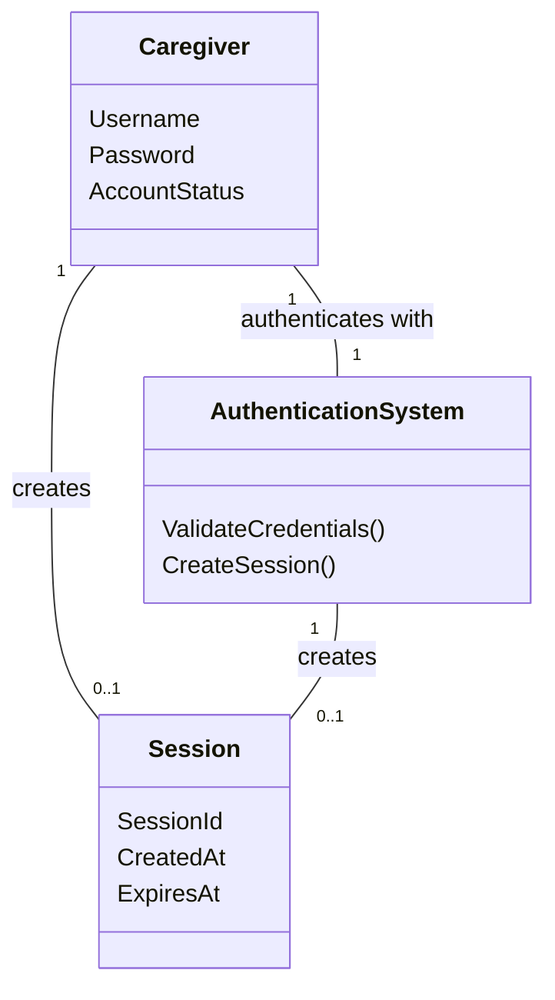

# Domain Model (DM) for Slottets Drifttavlen - User Login
## Metadata
| Key               | Value                             |
|-------------------|-----------------------------------|
| Id                | UC-004.DM                         |
| crossReference    | BC   REQ-F-005                 |

## Version Log
| Version | Date       | Description              | Author     |
|---------|------------|--------------------------|------------|
| 0001    | 2026-03-30 | Initial                  | Team 6     |

## Diagram

## Notes
 # Validation
 Validated for:
 - Template compliance (metadata, version log, diagram, notes, translation section)
 - Structure and naming conventions
 - Language and translation requirements
- The Caregiver entity represents the user logging in, with credentials and account status (e.g., active, locked).
- The AuthenticationSystem validates credentials and manages session creation.
- Session represents an authenticated user session with timestamps.
- Extensions such as account lock, invalid credentials, and service unavailability are handled by the AuthenticationSystem.

## Terms Translation
| English            | Danish                |
|--------------------|----------------------|
| Caregiver          | Medarbejder          |
| AuthenticationSystem | Autentifikationssystem |
| Session            | Session              |
| Username           | Brugernavn           |
| Password           | Adgangskode          |
| AccountStatus      | Kontostatus          |
| ValidateCredentials| ValiderLegitimationsoplysninger |
| CreateSession      | OpretSession         |
| CreatedAt          | OprettetDato         |
| ExpiresAt          | UdløberDato          |

