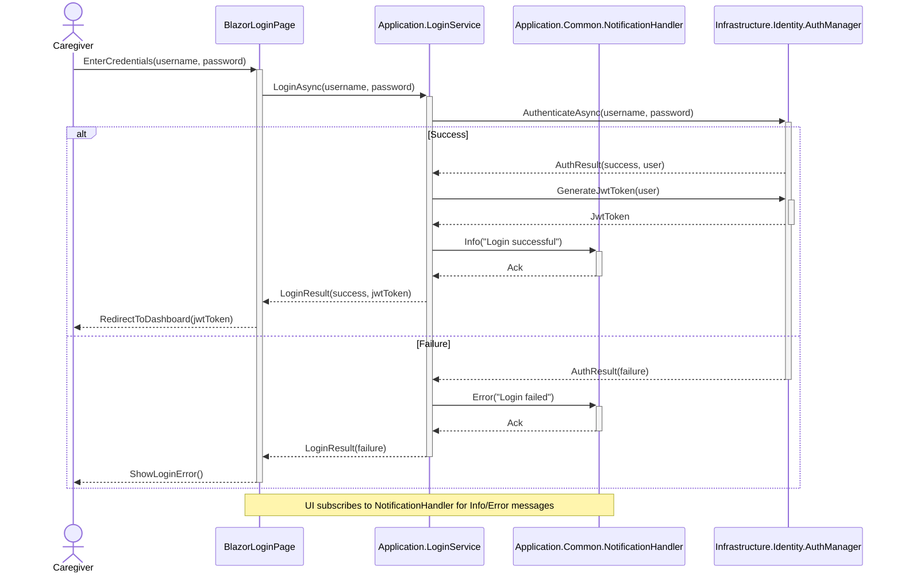
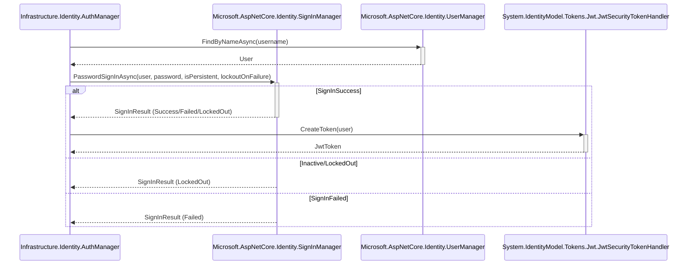
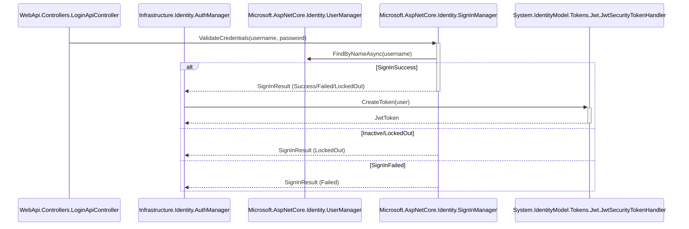

# User Login Sequence Diagram

## Metadata
| Key            | Value           |
|----------------|-----------------|
| Id             | UC-004.SD       |
| crossReference | UC-004.SSD UC-004.OC   |

## Version Log
| Version | Date       | Description | Author |
|---------|------------|-------------|--------|
| 0001    | 2026-03-30 | Initial     | Team 6 |

## Sequence Diagram

### Presentation Layer → Application Layer

### Application Layer → Infrastructure Layer (External Interfaces)

### WebApi Layer → Application Layer (Authentication & JWT)

> **Note:** Login with WebApi is only used for WebAssembly clients.

#### Notes
- `AuthManager` abstracts the Identity framework and is responsible for all authentication logic, including JWT generation.
- `SignInManager` and `UserManager` are from `Microsoft.AspNetCore.Identity`.
- `JwtSecurityTokenHandler` is used to generate the JWT.
- `NotificationHandler` is responsible for publishing Info and Error messages to which the UI subscribes.
- No internal system calls are shown beyond the manager abstraction.
- DTOs are used for credential transfer between layers.

## Need checking for:
- Identity framework integration and abstraction in `AuthManager`.
- Identity repository implementation for credential validation (e.g., `UserManager` and `SignInManager`).
