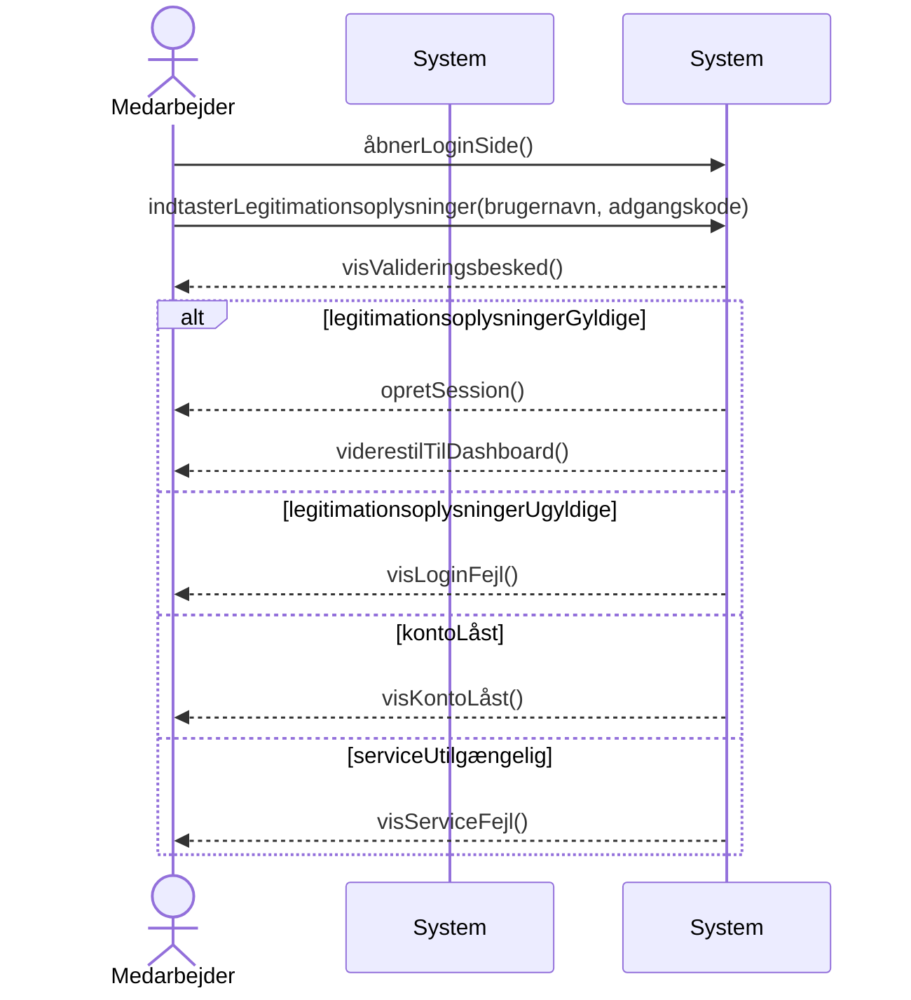

# Systemsekvensdiagram for UC-004: Login
## Metadata
| Nøgle            | Værdi           |
|------------------|-----------------|
| Id               | UC-004.SSD      |
| crossReference   | UC-004 UC-004.DM|

## Versionslog
| Version | Dato       | Beskrivelse | Forfatter |
|---------|------------|-------------|-----------|
| 0001    | 2026-03-30 | Initial     | Team 6    |

## Systemsekvensdiagram

## Sprogoversættelse
| Original Term           | Dansk Oversættelse         |
|------------------------|----------------------------|
| Caregiver              | Medarbejder                |
| AuthenticationSystem   | Autentifikationssystem     |
| openLoginPage          | åbnerLoginSide             |
| enterCredentials       | indtasterLegitimationsoplysninger |
| showValidationMessage  | visValideringsbesked       |
| createSession          | opretSession               |
| redirectToDashboard    | viderestilTilDashboard     |
| showLoginError         | visLoginFejl               |
| showAccountLocked      | visKontoLåst               |
| showServiceError       | visServiceFejl             |
