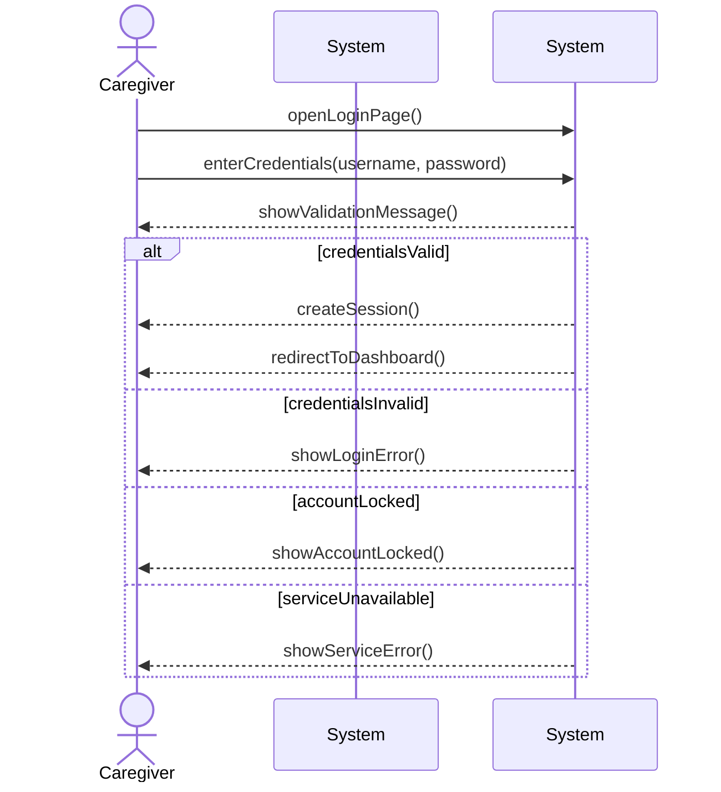

# System Sequence Diagram for Use Case UC-004: Login
## Metadata
| Key            | Value           |
|----------------|-----------------|
| Id             | UC-004.SSD      |
| crossReference | UC-004 UC-004.DM|

## Version Log
| Version | Date       | Description | Author |
|---------|------------|-------------|--------|
| 0001    | 2026-03-30 | Initial     | Team 6 |

## System Sequence Diagram

## Language Translation
| Original Term           | Danish Translation         |
|------------------------|---------------------------|
| Caregiver              | Medarbejder               |
| AuthenticationSystem   | Autentifikationssystem    |
| openLoginPage          | åbnerLoginSide            |
| enterCredentials       | indtasterLegitimationsoplysninger |
| showValidationMessage  | visValideringsbesked      |
| createSession          | opretSession              |
| redirectToDashboard    | viderestilTilDashboard    |
| showLoginError         | visLoginFejl              |
| showAccountLocked      | visKontoLåst              |
| showServiceError       | visServiceFejl            |
