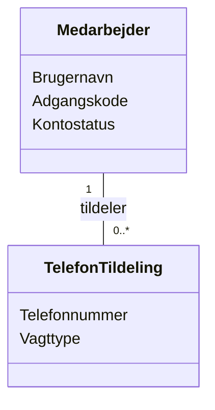

# Domain Model (DM) for Slottets Drifttavlen - Dashboard PhoneList
## Metadata
| Key               | Value                             |
|-------------------|-----------------------------------|
| Id                | UC-005.DM                         |
| crossReference    | BC                                |

## Version Log
| Version | Date       | Description                                 | Author |
|---------|------------|---------------------------------------------|--------|
| 0001    | 2026-03-31 | Initial domænemodel for Dashboard Telefonliste | Team 6 |

## Diagram

## Noter
- TelefonTildeling repræsenterer tildeling af et fast telefonnummer til en vagt.
- Telefonnummer er fast til én af: 41522, 41523, 41524, 41525, 41526, 41527, 41529.
- Vagttype er én af: Dag, Aften, Nat.
- Medarbejder er introduceret i UC-004 og repræsenterer den medarbejder der tildeler telefonnumre.
