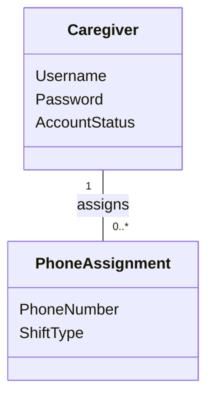

# Domain Model (DM) for Slottets Drifttavlen - Dashboard PhoneList
## Metadata
| Key               | Value                             |
|-------------------|-----------------------------------|
| Id                | UC-005.DM                         |
| crossReference    | BC                                |

## Version Log
| Version | Date       | Description                                 | Author |
|---------|------------|---------------------------------------------|--------|
| 0001    | 2026-03-31 | Initial domain model for Dashboard PhoneList | Team 6 |

## Diagram

## Notes
- PhoneAssignment represents assignment of a fixed phone number to a shift.
- PhoneNumber is fixed to one of: 41522, 41523, 41524, 41525, 41526, 41527, 41529.
- ShiftType is one of: Day, Evening, Night.
- Caregiver is introduced in UC-004 and represents the staff member assigning phone numbers.

## Terms Translation
| English         | Danish            |
|----------------|-------------------|
| Caregiver      | Medarbejder       |
| PhoneAssignment| TelefonTildeling  |
| PhoneNumber    | Telefonnummer     |
| ShiftType      | Vagttype          |
| Day            | Dag               |
| Evening        | Aften             |
| Night          | Nat               |
| assigns        | tildeler          |
