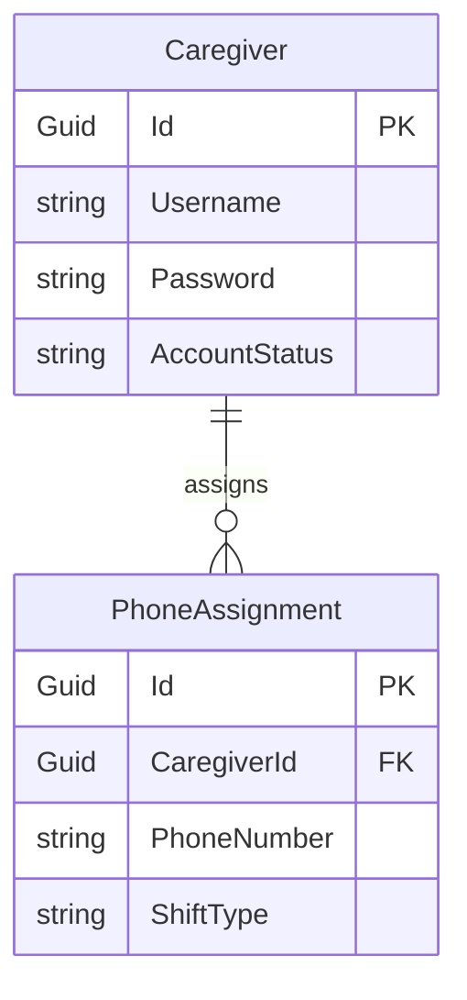

# Entity Relationship Diagram (ERD) for UC-005 Dashboard PhoneList

## Metadata
| Key            | Value                                  |
|----------------|----------------------------------------|
| Id             | UC-005.ERD                             |
| crossReference | UC-005.DM UC-005.DCD UC-005.SSD UC-005.SD UC-005.OC |

## Version Log
| Version | Date       | Description                               | Author |
|---------|------------|-------------------------------------------|--------|
| 0001    | 2026-04-13 | Initial ERD for Dashboard PhoneList       | Team 6 |

## Diagram

## Notes
- Caregiver represents the staff member (introduced in UC-004) who carries a work phone during a shift.
- PhoneAssignment links a Caregiver to a fixed work phone number for a specific shift type (Day, Evening, Night).
- PhoneNumber is fixed to one of: 41522, 41523, 41524, 41525, 41526, 41527, 41529 and these values never change.
- ShiftType is constrained to the values: Day, Evening, Night.
- Each PhoneAssignment references exactly one Caregiver through CaregiverId and represents one assignment for one shift type.
- All entities use Guid as primary key (Id).
