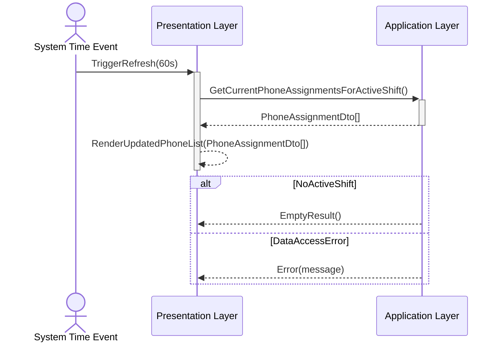
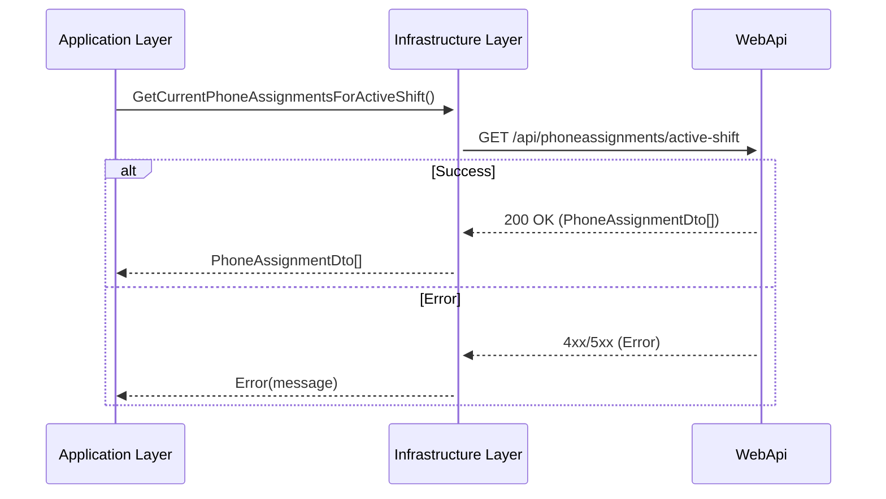

# UC-005 Dashboard PhoneList Sequence Diagram

## Metadata
| Key            | Value                 |
|----------------|-----------------------|
| Id             | UC-005.SD             |
| crossReference | UC-005.SSD UC-005.OC  |

## Version Log
| Version | Date       | Description                     | Author |
|---------|------------|---------------------------------|--------|
| 0001    | 2026-04-04 | Initial SD (auto refresh only)  | Team 6 |

## Sequence Diagram: Dashboard PhoneList (Automatic Refresh)

### Presentation Layer → Application Layer

### WebApi Layer → Infrastructure Layer (Data Access)

## Notes
- Scope: only the automatic refresh of PhoneList every 60 seconds, triggered by `System Time Event`.
- The dashboard requests current PhoneAssignments for the active shift.
- Data access uses WebAPI and is abstracted by the Infrastructure `PhoneAssignmentManager`.
- Returned data is represented as DTOs (`PhoneAssignmentDto[]`) across boundaries.
- `PhoneAssignment` domain concept includes `PhoneNumber` and `ShiftType`.
- Clean Architecture dependency direction is preserved (Infrastructure → Application → Domain).

## Language Handling
Professional English.
